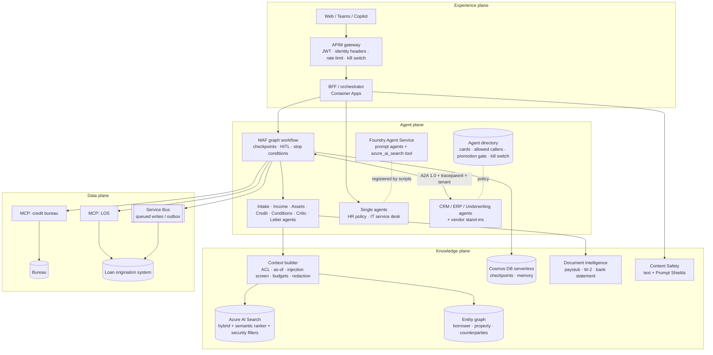
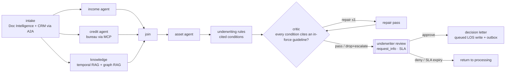

# azure-agent-platform

## At a glance (for recruiters)

- **Multi-agent mortgage underwriting on Azure:** agents read the loan documents (pay stubs, W-2s, bank statements), run income, credit and guideline checks in parallel, review assets, have a critic agent verify every condition cites a guideline, then pause for a human underwriter's approval before issuing the decision letter.
- **Survives crashes:** the workflow checkpoints its state, so a restarted process resumes the loan where it left off instead of starting over (covered by tests).
- **Governed agent-to-agent (A2A) calls:** CRM, ERP and underwriting agents publish agent cards; a directory controls who may call whom, requires an eval score before promotion, and has a kill switch.
- **All five Microsoft Agent Framework built-in orchestrations** (sequential, concurrent, handoff, group chat, Magentic) run on the same loan review and are compared side by side.
- **Cost-minimized infrastructure as code:** Bicep templates for `azd up` (cost-min profile by default, not deployed yet); 113 automated tests plus eval release gates run in CI.
- **Terraform + Bicep, GitHub Actions deploy:** the same infrastructure in both tools ([`infra/terraform`](infra/terraform/README.md)), and a GitHub Actions pipeline with OIDC login (no secrets), a Bicep/Terraform choice, and dev -> prod approval gates. The pipeline is gated off until a subscription exists ([docs/deployment.md](docs/deployment.md)).

**Skills demonstrated:** Azure AI Foundry, Microsoft Agent Framework, Azure OpenAI, Azure AI Search, Document Intelligence, Content Safety, MCP, A2A, Bicep/azd, Container Apps, APIM, Cosmos DB, Service Bus, Python.

*Honesty note: it runs fully offline with deterministic mocks and has not been deployed to live Azure yet (see [Honest limitations](#honest-limitations)).*

**Contents:** [What](#at-a-glance-for-recruiters) · [Why](#why-it-exists) · [Architecture](#architecture-four-planes) · [Run](#run-locally-offline-no-azure) · [Test](#test) · [Deploy](#deploy-to-azure) · [Limits](#honest-limitations) · [Docs](#documentation)

An Azure-native agentic AI platform showcase: a **mortgage loan origination and underwriting-conditions multi-agent system** built on **Microsoft Agent Framework (MAF) 1.x** and **Microsoft Foundry**, plus:

* an **A2A agent control plane**
* **MCP** tool servers
* single-agent examples
* **azure-ai-evaluation** release gates
* **`azd up`** infrastructure with a cost-min profile

It runs fully offline with deterministic mocks, and switches to real Azure with `AAP_MODE=azure` plus the `azd` outputs.

> Companion to my LangGraph portfolio. This repo is the "80% Azure" version: the same doctrine, expressed with Foundry, MAF, AI Search, Document Intelligence, Content Safety, Container Apps, APIM, Cosmos DB, and Service Bus.
> SDK versions and API shapes were checked against the installed packages. See [docs/sdk-notes.md](docs/sdk-notes.md).

---

## Why it exists

Lending is a good stress test for enterprise agents: decisions must cite the rule that applied on the application date, some users may see guideline overlays that others may not, a human signs off before anything is issued, and every number has to be reproducible. This repo shows how those requirements map onto Azure's own services (Foundry, Agent Framework, AI Search, Document Intelligence, Content Safety, Container Apps, APIM, Cosmos DB, Service Bus), so a client team can see which service carries which control and what it would cost to run.

## Architecture: four planes



### The flagship graph (MAF `WorkflowBuilder`)



### Request sequence (ten steps)

```mermaid
sequenceDiagram
  autonumber
  participant LO as Loan officer (web/Teams)
  participant APIM as APIM
  participant BFF as BFF (Container Apps)
  participant WF as MAF graph
  participant CRM as CRM agent (A2A)
  participant MCP as MCP servers (LOS, bureau)
  participant KB as Context builder + AI Search
  participant FM as Foundry model
  participant UW as Underwriter
  participant SB as Service Bus → LOS
  LO->>APIM: POST /loans/L-1001/underwrite (Entra token)
  APIM->>BFF: identity headers + traceparent (kill switch, rate limit)
  BFF->>BFF: content safety, create run (thread) + checkpoint store
  BFF->>WF: start graph (principal, tenant, as-of = application date)
  WF->>MCP: get_loan_file · pull_tri_merge (idempotent request id)
  WF->>CRM: SendMessage get_borrower_profile (traceparent, x-tenant-id)
  WF->>KB: guidelines in force on app date, ACL-trimmed, graph neighbourhood
  WF->>FM: narratives on facts + deterministic draft (schema-validated)
  WF->>WF: rules → cited conditions → critic loop (≤1 repair)
  WF-->>UW: request_info (review packet, SLA) — graph checkpointed & idle
  UW->>BFF: POST /runs/{id}/decision (approve, remove conditions)
  BFF->>WF: resume from checkpoint with response
  WF->>SB: queue LOS status + outbox (idempotency key; compensate on failure)
  WF-->>LO: decision letter + trace id (App Insights end-to-end)
```

---

## What's inside

| Area | Highlights |
|---|---|
| **Flagship, mortgage underwriting** (`src/agentplatform/mortgage`) | Document Intelligence prebuilt models (`prebuilt-payStub.us`, `prebuilt-tax.us.w2`, `prebuilt-bankStatement.us`), with an offline mock that returns field/value/confidence. Income, asset, and credit agents. Credit is pulled through an MCP bureau server. **Temporal RAG** uses the investor guideline versions in force on the application date. **Graph RAG** does related-party and non-arm's-length detection. A **critic** makes sure every condition cites a guideline. **HITL** underwriter approval comes before the letter. Checkpoints live in File or Cosmos storage. Stop conditions and a **five-exit failure table** ([docs/failure-table.md](docs/failure-table.md)) round it out. |
| **A2A control plane** (`src/agentplatform/a2a`, `control-plane/agent-cards`) | Agent cards for custom **CRM**, **ERP**, and **Underwriting** agents, plus clearly labelled **STAND-IN** "Dynamics 365-style", "Salesforce-style", and "SAP-style" agents that follow the same card contract. The directory handles who-may-call-whom, stage, the promotion gate (eval ≥ 0.85), and the kill switch. `traceparent` and tenant propagate on every hop. The server re-checks policy, and write-HITL skills require `approved_by`. |
| **MCP tool plane** (`src/agentplatform/mcp_servers`) | `credit-bureau` and `los` servers on mcp 2.x `MCPServer` (streamable HTTP). A gateway applies budgets, idempotency, schema validation, and transient-error mapping. |
| **Orchestration patterns** (`src/agentplatform/orchestrations`) | One loan conditions review run through all five prebuilt MAF builders, from `agent-framework-orchestrations`. **Sequential** has human review of the answer and checkpoint resume. **Concurrent** has a deterministic aggregator. **Handoff** uses `handoff_to_*` routing, with `HandoffAgentUserRequest` to ask the user. **Group chat** is maker-checker, using either a `selection_func` or an LLM orchestrator, with a round cap. **Magentic** has manager ledgers, plan review, and stall → reset → replan. A generated comparison of model calls, turns, pauses and fault drills is in [docs/orchestration-patterns.md](docs/orchestration-patterns.md). |
| **Single agents** (`src/agentplatform/single`) | The **HR policy agent** is a MAF agent with an AI Search tool, per-request temporal and ACL filtering, and cited `PolicyAnswer` output. The **IT service desk agent** is a MAF agent where the password reset is `approval_mode="always_require"`. Both are also registered as **Foundry Agent Service** prompt agents (`scripts/foundry_register.py`). |
| **Evals** (`src/agentplatform/evals`, `scripts/run_evals.py`) | Golden sets and custom evaluators (policy compliance, condition recall/leak, citation exact-match) feed a release gate that fails CI. With `--azure`, `azure-ai-evaluation` Groundedness and Relevance run alongside the custom evaluators via `evaluate()`, logged to the Foundry project. |
| **Safety** | Content Safety runs on inbound text and on retrieved passages. Prompt Shields (REST) catches injection. The context builder also drops injected passages offline. |
| **Harness** | Identity envelope, budgets (steps, tokens, identical-call caps), kill switch, retry with circuit breaker, outbox, and OpenTelemetry. Traces go to Azure Monitor when `APPLICATIONINSIGHTS_CONNECTION_STRING` is set, and to the console otherwise. |
| **Infra** (`infra/`, `azure.yaml`) | Bicep for `azd up`: Foundry account and project with model deployments, AI Search, Document Intelligence, Content Safety, Container Apps (6 apps), APIM, Cosmos serverless, Service Bus, Key Vault, ACR, Log Analytics and App Insights. Two least-privilege managed identities. Optional Private Link. `cost-min` is the default profile. |
| **Engineering layers** | Eight layers stacked from the bottom up: prompts and context at the base, then workflows, agents and graphs, then loops, the runtime harness, and finally the platform. See [docs/engineering-layers.md](docs/engineering-layers.md). |

## Industry mapping

The platform pieces carry over across industries. Only the prompts, tools, corpora, and rules change.

| Platform piece | Mortgage (this repo) | Banking | Insurance | Healthcare | Retail |
|---|---|---|---|---|---|
| Document Intelligence intake | Paystub / W-2 / bank statement | KYC docs, financial statements | FNOL forms, repair estimates | Referrals, EOBs, prior-auth forms | Supplier invoices, returns labels |
| Temporal RAG (as-of) | Investor guidelines on the application date | Credit policy on the origination date | Policy wording in force on the loss date | Payer medical policy on the date of service | Return / price-match policy on the purchase date |
| Graph RAG | Borrower ↔ seller ↔ agent ↔ appraiser (non-arm's-length) | Beneficial ownership, AML rings | Claimant ↔ provider ↔ repair shop fraud rings | Patient ↔ provider ↔ facility networks | Customer ↔ order ↔ return abuse |
| MCP tools (read / queued write) | Bureau, LOS | Core banking, AML screening | Policy admin, claims system | EHR (FHIR), eligibility | OMS, inventory, payments |
| A2A domain agents | CRM, ERP, underwriting | Relationship-manager CRM, GL | Policy admin (Guidewire-style), billing | Care management, RCM | CRM, ERP (SAP-style) |
| Critic + HITL gate | Conditions cite guidelines; underwriter approves | Credit memo reviewed by a credit officer | Payout above threshold goes to an adjuster | Clinical reviewer for denials | Refund above threshold goes to an agent |

## Run locally (offline, no Azure)

```bash
python -m venv .venv && . .venv/bin/activate && pip install -e ".[dev]"
make lint            # ruff check + ruff format --check
make test            # pytest (113 tests, offline)
make demo            # underwrite L-1001 / L-1002 / L-1003, approve, print letters
make orchestrations  # the five MAF orchestration patterns + comparison table
make evals           # golden-set eval gate
uvicorn agentplatform.bff:app --port 8080     # in-process BFF
make mesh            # every service as its own process over HTTP (no Docker)
docker compose up --build                      # same topology in containers
```

```bash
curl -X POST localhost:8080/loans/L-1001/underwrite                       # → awaiting_underwriter + review packet
curl -X POST localhost:8080/runs/<run_id>/decision -H 'content-type: application/json' -d '{"approved": true}'
curl localhost:8080/directory                                              # agent cards
curl localhost:9201/.well-known/agent-card.json                            # (mesh) CRM agent card
curl -X POST localhost:8080/chat/hr -H 'content-type: application/json' -d '{"message":"How many weeks of parental leave?"}'
```

The demo produces three outcomes:

| Loan | Outcome | Why |
|---|---|---|
| L-1001 | Approved with 4 conditions | Every condition cites a guideline |
| L-1002 | Referred | DTI 48.1% exceeds the v1 limit of 45% that was in force on its application date. The bank statement is unreadable, so a "legible copy" condition is added instead of a guessed value. |
| L-1003 | Approved with conditions | The v2 DTI rule with a reserves offset applies. A related-party (non-arm's-length) condition comes from the graph. A confidential investor overlay appears only for the senior-underwriter group. |

## Test

```bash
make lint && make test                        # ruff + 113 offline tests
make evals                                    # golden-set eval gate (fails on regression)
python scripts/export_agent_cards.py --check  # agent cards match the code
make bicep                                    # bicep build, no warnings
cd infra/terraform && terraform init -backend=false && terraform validate && terraform test
```

CI runs the same checks on every push ([`.github/workflows/`](.github/workflows/README.md)).

## Deploy to Azure

```bash
azd auth login && azd env new aap-dev --location eastus2 && azd up
```

The postprovision hook seeds AI Search, registers the Foundry agents, and checks the agent cards. For details, see [docs/deploy.md](docs/deploy.md). For resources, SKUs, and billing dimensions, see [docs/cost-estimate.md](docs/cost-estimate.md). **Tear down with `azd down --purge`.** CI (`.github/workflows/ci.yml`) runs lint, tests, the card-freshness check, the eval gate, and `bicep build`; `infra.yml` validates, tests, lints and scans the Terraform twin in [`infra/terraform`](infra/terraform/README.md). The GitHub Actions deploy pipeline (Bicep or Terraform, OIDC, dev -> prod with approval) is described in [docs/deployment.md](docs/deployment.md) and stays disabled unless `DEPLOY_ENABLED=true`.

## Doctrine card: mortgage underwriting-conditions system

| Item | Answer |
|---|---|
| **Maturity level** | Level 5 (multi-agent process) *with a human decision gate*. The system drafts conditions and letters. It never issues an adverse action on its own, and the rules engine never outputs "deny". |
| **Plane dependencies** | Experience: APIM, BFF. Agent: MAF graph, Foundry models, A2A CRM/ERP. Knowledge: AI Search guidelines index, entity graph, Cosmos checkpoints, Document Intelligence, Content Safety. Data: LOS, credit bureau, Service Bus. |
| **System-of-record APIs** | LOS (`get_loan_file`, `queue_status_update`) and credit bureau (`pull_tri_merge`, `get_report`) over MCP. CRM `get_borrower_profile` and ERP fee ledger over A2A. |
| **Retrieval corpus & ACL** | Investor guidelines, versioned with `effective_from` / `effective_to`, filtered as-of the application date. `allowed_groups` security trimming hides the confidential overlays from non-senior users. Machine-readable rule params are in `params_json`. |
| **MCP / A2A contracts** | MCP tool schemas are validated by the gateway. A2A 1.0 cards are at `/.well-known/agent-card.json`, with a control-plane extension (owner, stage, side-effect class, allowed callers, eval score). |
| **Stop conditions** | `max_iterations` on the graph, at most 1 critic repair, step / token / tool budgets, identical-call caps, a HITL SLA (expiry means return to processing, never auto-approve), and the kill switch. |
| **Failure playbooks** | A five-exit table per node ([docs/failure-table.md](docs/failure-table.md)), chaos-tested: model down, search down, bureau down or timeout, LOS write failure, injected guideline, kill switch. |
| **Eval set** | `src/agentplatform/evals/golden/mortgage_conditions.jsonl` (recommendation, required and forbidden conditions, including the ACL case) and `hr_policy.jsonl`. The gate requires policy compliance = 1.0, condition recall ≥ 0.95, and zero leaks. |
| **Owner** | `mortgage-ai@contoso` (card) and the underwriting operations lead (business) |
| **KPIs** | Time from application to conditional approval, conditions per file, condition rework rate, share of conditions overturned by underwriters, and cost per file (tokens + DI pages). |

## Five interview talking points

1. **Temporal and ACL-aware retrieval is the actual moat.** The same question gets different guideline versions depending on the application date, and different overlays depending on who asks. Both are enforced as AI Search OData filters, below the model. The context builder re-checks them and screens injected passages, so the model never sees tokens it isn't entitled to.
2. **Numbers never come from the LLM.** DTI, reserves, and qualifying income come from calculators and rule params stored with the guideline. Agents only write narrative over facts plus a deterministic draft, with schema-validated output. When the model is down, the graph degrades to the draft. The answer is limited but true, and the file doesn't stall.
3. **HITL is a checkpoint, not a UI trick.** MAF `request_info` parks the graph durably in Cosmos. A restarted replica resumes from the checkpoint. The SLA timer resolves to "return to processing", never to silent approval. Writes go through Service Bus with idempotency keys and a compensating status.
4. **Control plane before agent sprawl.** Every agent, including vendor stand-ins, publishes an A2A card with owner, stage, side-effect class, and allowed callers. The directory enforces who-may-call-whom, and so does the callee. Promotion requires the eval score. Kill switches exist at APIM (global) and in the directory (per agent). `traceparent` and tenant ride every hop, so one App Insights trace spans BFF → graph → A2A → MCP.
5. **Single agent vs multi-agent is an engineering decision.** HR Q&A is one Foundry prompt agent with the `azure_ai_search` tool. IT triage is one MAF agent with an approval-gated tool. Mortgage is a graph because it needs parallel evidence, a critic loop, durable HITL, and compensating writes. The infra is cost-min by default: scale-to-zero apps, serverless Cosmos, Consumption APIM, pay-per-call AI. That keeps a demo tenant cheap while staying production-shaped.

## Repo layout

```
src/agentplatform/   config · harness/ · prompts/ · context/ · knowledge/ · docintel/ · llm/ · safety/
                     mcp_servers/ · mortgage/ · orchestrations/ · a2a/ · single/ · evals/ · bff.py
control-plane/       agent-cards/*.json (+ _policy.json), generated by scripts/export_agent_cards.py
infra/               main.bicep, main.parameters.json, modules/*.bicep, terraform/ (Terraform twin)
services/            bff/, a2a/, mcp/ Dockerfiles
scripts/             foundry_register · seed_search_index · run_evals · export_agent_cards · render_docs · demo · orchestrations_demo · run_local_mesh · postprovision
docs/                components/ · implementation-guide · adopt-this · architecture · orchestration-patterns · engineering-layers · failure-table · cost-estimate · deploy · deployment · sdk-notes · best-practices · adr/
tests/               113 offline tests (pytest)
```

### Repository map

Every folder has its own README with a file-by-file table:

| Folder | What's there |
|---|---|
| [`src/agentplatform/`](src/agentplatform/README.md) | Python package overview and module map |
| [`src/agentplatform/harness/`](src/agentplatform/harness/README.md) | Five-exit failure handling, budgets, resilience, kill switch, outbox, tracing, identity |
| [`src/agentplatform/prompts/`](src/agentplatform/prompts/README.md) | Versioned prompt pack and registry (pack files documented here) |
| [`src/agentplatform/context/`](src/agentplatform/context/README.md) | Temporal/ACL-aware context builder |
| [`src/agentplatform/knowledge/`](src/agentplatform/knowledge/README.md) | Hybrid retrieval (Azure AI Search or offline stand-in), index schema |
| [`src/agentplatform/knowledge/data/`](src/agentplatform/knowledge/data/README.md) | Synthetic guideline and HR-policy data |
| [`src/agentplatform/docintel/`](src/agentplatform/docintel/README.md) | Document Intelligence extractor |
| [`src/agentplatform/docintel/fixtures/`](src/agentplatform/docintel/fixtures/README.md) | Offline extraction fixtures |
| [`src/agentplatform/llm/`](src/agentplatform/llm/README.md) | Chat client factory and deterministic mock |
| [`src/agentplatform/safety/`](src/agentplatform/safety/README.md) | Content Safety gate |
| [`src/agentplatform/mcp_servers/`](src/agentplatform/mcp_servers/README.md) | MCP servers (LOS, credit bureau) and gateway |
| [`src/agentplatform/mortgage/`](src/agentplatform/mortgage/README.md) | Flagship underwriting graph, rules, agents |
| [`src/agentplatform/mortgage/data/`](src/agentplatform/mortgage/data/README.md) | Synthetic loan files |
| [`src/agentplatform/orchestrations/`](src/agentplatform/orchestrations/README.md) | MAF prebuilt orchestrations (sequential, concurrent, handoff, group chat, Magentic) on one loan review, with a measured comparison |
| [`src/agentplatform/a2a/`](src/agentplatform/a2a/README.md) | A2A agents, catalog, cards, server, client, registry |
| [`src/agentplatform/single/`](src/agentplatform/single/README.md) | Single-agent HR and IT examples |
| [`src/agentplatform/evals/`](src/agentplatform/evals/README.md) | Eval runner and release gate |
| [`src/agentplatform/evals/golden/`](src/agentplatform/evals/golden/README.md) | Golden eval sets |
| [`control-plane/`](control-plane/README.md) | Generated agent-directory artefacts |
| [`control-plane/agent-cards/`](control-plane/agent-cards/README.md) | Generated A2A agent cards and policy |
| [`infra/`](infra/README.md) | Bicep entry point and azd parameters |
| [`infra/modules/`](infra/modules/README.md) | Bicep modules |
| [`infra/terraform/`](infra/terraform/README.md) | Terraform twin of the Bicep (modules, dev/prod tfvars, remote state, offline tests) |
| [`services/`](services/README.md) | One Dockerfile per runtime plane |
| [`services/bff/`](services/bff/README.md) | BFF container |
| [`services/a2a/`](services/a2a/README.md) | A2A agent container |
| [`services/mcp/`](services/mcp/README.md) | MCP server container |
| [`scripts/`](scripts/README.md) | Demo, evals, card export, Azure dry-run scripts |
| [`docs/`](docs/README.md) | Architecture and engineering docs, best practices, ADRs ([`docs/adr/`](docs/adr/README.md)) |
| [`tests/`](tests/README.md) | Offline test suite |
| [`.github/`](.github/README.md) | Workflows, deploy scripts and `CODEOWNERS` |
| [`.github/workflows/`](.github/workflows/README.md) | CI, infrastructure checks, deploy and teardown workflows |
| [`.github/scripts/`](.github/scripts/README.md) | Shell steps used by the deploy workflows |

## Honest limitations

* The Azure code paths (Foundry, Search, DI, Content Safety, Cosmos, Service Bus, Azure Monitor) follow the verified SDK signatures but were **not executed against Azure**. No resources were created.
* Bicep compiles cleanly (`bicep build`, 0 warnings). A real `azd provision` or what-if has not been run. The three service images are built and smoke-tested in CI (`infra.yml`), and the same topology runs over HTTP locally via `make mesh`.
* All loans, borrowers, guidelines, and HR policies are synthetic. The "Dynamics 365-style", "Salesforce-style", and "SAP-style" agents are stand-ins, not vendor products.
* The Terraform twin passes `validate`, offline `terraform test`, tflint and checkov, but no `terraform plan` has run against a subscription. The GitHub Actions deploy pipeline is switched off (`DEPLOY_ENABLED` is not set), and its GitHub Environments and reviewers do not exist yet.
* Eval scores come from small synthetic golden sets and a deterministic mock model. They show the gates work, not how a real model would score. No fair-lending evaluation has been done.

## Documentation

| Document | What it covers |
|---|---|
| [`docs/components/`](docs/components/README.md) | One page per component (14) with the same 17 sections: purpose, mermaid architecture, step-by-step flow, key files, generated code excerpts and real output, configuration, commands, tests and eval gates, guardrails, security, observability, failure modes, Azure mapping, limitations, talking points and "Adopt this" |
| [`docs/implementation-guide.md`](docs/implementation-guide.md) | How the platform is built, layer by layer, with the command and test that prove each step |
| [`docs/adopt-this.md`](docs/adopt-this.md) | How another team reuses, configures and extends the platform without losing its controls |
| [`docs/best-practices.md`](docs/best-practices.md) | Enterprise cloud and agentic AI practices, each marked implemented, written-not-deployed or planned, with links to the code |
| [`docs/adr/`](docs/adr/README.md) | Architecture decision records (Bicep + Terraform, offline mocks, OIDC, eval gates, gated deploy, ...) |
| [`docs/deployment.md`](docs/deployment.md) | The GitHub Actions pipeline and the one-time Azure setup it needs |
| [`docs/architecture.md`](docs/architecture.md) · [`docs/engineering-layers.md`](docs/engineering-layers.md) · [`docs/failure-table.md`](docs/failure-table.md) | Planes and sequence, the eight engineering layers, the five-exit failure table |
| [`SECURITY.md`](SECURITY.md) · [`CONTRIBUTING.md`](CONTRIBUTING.md) · [`CHANGELOG.md`](CHANGELOG.md) | How to report a vulnerability, how to contribute, what changed |

**Related: data platform.** [Jagadish-fabric-enterprise-bi](https://github.com/jagadishmazure-jpg/Jagadish-fabric-enterprise-bi) is the governed Microsoft Fabric data layer for these agents. Its data agent publishes an A2A card with the same control-plane extension (so this platform's directory can register it) and an MCP server, and its vector store can ground this repo's RAG layer with data definitions and data product contracts.

## License

MIT © Jagadish Meduri
