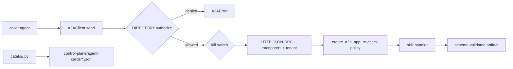

# A2A fabric and control plane (`src/agentplatform/a2a/`, `control-plane/`)

Agents calling agents over A2A 1.0, with a directory that decides who may call whom, a promotion gate, kill switches and checked-in agent cards.

**Sections:** [1. Purpose](#1-purpose) · [2. Architecture](#2-architecture) · [3. How it works](#3-how-it-works) · [4. Key files](#4-key-files) · [5. Code excerpts](#5-code-excerpts) · [6. Configuration](#6-configuration) · [7. Commands](#7-commands) · [8. Real output](#8-real-output) · [9. Tests and eval gates](#9-tests-and-eval-gates) · [10. Guardrails](#10-guardrails) · [11. Security and governance](#11-security-and-governance) · [12. Observability](#12-observability) · [13. Failure modes](#13-failure-modes) · [14. Mapping to Azure services](#14-mapping-to-azure-services) · [15. Limitations](#15-limitations) · [16. Interview talking points](#16-interview-talking-points) · [17. Adopt this](#17-adopt-this)

## 1. Purpose

When domain teams own their agents (CRM, ERP, underwriting), calls between them need the same controls as service-to-service APIs: identity, allow-lists, versioned contracts and the ability to switch an agent off. This package provides that for first-party agents and for clearly labelled vendor stand-ins.

## 2. Architecture



## 3. How it works

1. `catalog.py` declares each agent: owner, version, skills (read, write-queued, write-hitl) and allowed callers.
2. `export_agent_cards.py` renders the A2A agent cards with a control-plane extension; CI fails if the checked-in cards drift.
3. `A2AClient.send` checks the directory and kill switch, sends JSON-RPC with `traceparent` and tenant headers, and validates the returned artifact.
4. The callee's server repeats the policy check (defence in depth behind API Management).
5. `AgentDirectory.register` is the promotion gate: production requires an eval score of at least 0.85.

## 4. Key files

| File | What it holds |
|---|---|
| `src/agentplatform/a2a/catalog.py` | agent specs |
| `src/agentplatform/a2a/cards.py` | card contract and extension |
| `src/agentplatform/a2a/registry.py` | `AgentDirectory`: authorize, register, kill, revive |
| `src/agentplatform/a2a/client.py` | `A2AClient` |
| `src/agentplatform/a2a/server.py` | `create_a2a_app` |
| `src/agentplatform/a2a/local.py` | in-process mesh for tests |
| `control-plane/agent-cards/` | generated cards and `_policy.json` |
| `scripts/export_agent_cards.py` | render and `--check` |

## 5. Code excerpts

<!-- code: src/agentplatform/a2a/registry.py::AgentDirectory.authorize -->
```python
def authorize(self, caller: str, callee: str, tenant: str, skill: str) -> PolicyDecision:
    spec = self._specs.get(callee)
    if spec is None:
        return PolicyDecision(False, f"unknown agent {callee}")
    if self.kill_switch.is_tripped(callee, tenant):
        return PolicyDecision(False, f"kill switch engaged for {callee}/{tenant}")
    if caller not in spec.allowed_callers:
        return PolicyDecision(False, f"{caller} may not call {callee}")
    if "*" not in spec.tenants and tenant not in spec.tenants:
        return PolicyDecision(False, f"tenant {tenant} not enabled for {callee}")
    if spec.skill(skill) is None:
        return PolicyDecision(False, f"{callee} has no skill {skill}")
    return PolicyDecision(True, "allowed")
```
<!-- /code -->

<!-- code: src/agentplatform/a2a/registry.py::AgentDirectory.register -->
```python
def register(self, spec: AgentSpec) -> PolicyDecision:
    """Registration before production DNS: production stage requires an eval score >= gate."""
    if spec.stage == "production" and spec.eval_score < PROMOTION_MIN_EVAL:
        return PolicyDecision(
            False, f"eval {spec.eval_score:.2f} below promotion gate {PROMOTION_MIN_EVAL}"
        )
    self._specs[spec.id] = spec
    return PolicyDecision(True, "registered")
```
<!-- /code -->

## 6. Configuration

| Variable / field | Effect |
|---|---|
| `A2A_<AGENT>_URL` | callee URL in Container Apps (offline uses the in-process mesh) |
| `AGENT_ID`, `PORT` | which agent `python -m agentplatform.a2a` serves |
| `allowed_callers` | per-agent allow-list in `catalog.py` |
| `PROMOTION_MIN_EVAL` | 0.85 gate for production registration |

## 7. Commands

```bash
python scripts/component_demos.py a2a
python scripts/export_agent_cards.py --check
python -m agentplatform.a2a crm-agent
pytest tests/test_a2a.py -q
```

## 8. Real output

<!-- output: python scripts/component_demos.py a2a -->
```text
agents: ['underwriting-agent', 'crm-agent', 'erp-agent', 'dynamics-crm-standin', 'salesforce-crm-standin', 'sap-erp-standin']
underwriting-agent -> crm-agent.get_borrower_profile: allowed=True reason=allowed
hr-agent -> crm-agent.get_borrower_profile: allowed=False reason=hr-agent may not call crm-agent
underwriting-agent -> crm-agent.get_customer_profile: allowed=False reason=crm-agent has no skill get_customer_profile
```
<!-- /output -->

<!-- output: python scripts/export_agent_cards.py --check && echo agent cards match catalog.py -->
```text
agent cards match catalog.py
```
<!-- /output -->

## 9. Tests and eval gates

<!-- output: python -m pytest --co -q -p no:cacheprovider tests/test_a2a.py | grep '::' -->
```text
tests/test_a2a.py::test_every_agent_publishes_card_at_well_known_paths
tests/test_a2a.py::test_vendor_standins_are_clearly_labelled
tests/test_a2a.py::test_a2a_call_propagates_traceparent_and_tenant
tests/test_a2a.py::test_policy_denies_unlisted_caller_before_network
tests/test_a2a.py::test_server_enforces_policy_even_if_client_bypasses_it
tests/test_a2a.py::test_kill_switch_blocks_agent
tests/test_a2a.py::test_write_hitl_skill_requires_approval_and_writes_are_idempotent
tests/test_a2a.py::test_bff_to_underwriting_agent_to_crm_agent_chain
tests/test_a2a.py::test_registration_promotion_gate
tests/test_a2a.py::test_checked_in_cards_are_current
```
<!-- /output -->

## 10. Guardrails

- Policy is checked twice, by the client and by the server.
- `write-hitl` skills require `approved_by`; writes are idempotent.
- Stand-ins make no vendor API calls and say so in their cards.
- A tripped kill switch stops calls at the client, the server and (on Azure) APIM.

## 11. Security and governance

- Every card names an owner and version; the cards are reviewed like code.
- Tenant headers are required and checked.
- Promotion to production is gated on an eval score.

## 12. Observability

The client creates a child `traceparent` per hop and the server traces with it, so a CRM lookup appears inside the underwriting trace.

## 13. Failure modes

| Failure | What happens |
|---|---|
| caller not allowed | `A2AError` before any network call |
| unknown skill | denied with a reason |
| callee killed | `AgentDisabled`, the workflow degrades |
| malformed artifact | schema validation fails, treated as a tool error |

## 14. Mapping to Azure services

| Piece | Azure service |
|---|---|
| agent hosting | Azure Container Apps, one app per agent |
| edge policy | API Management (JWT validation, kill flag) |
| identity | Entra ID workload identities |
| directory | checked-in cards; Foundry agent catalogue as the managed alternative |

## 15. Limitations

- The directory is in memory; a real deployment needs a persistent registry.
- Stand-ins imitate vendor agent shapes only.

## 16. Interview talking points

- Treat agent-to-agent calls like APIs: contracts, owners, allow-lists and a kill switch.
- Generated, checked-in cards make contract drift a CI failure.

## 17. Adopt this

1. Add your agent to `catalog.py` with owner, skills and allowed callers.
2. Write a handler in `agents.py` and serve it with `create_a2a_app`.
3. Run `export_agent_cards.py` and commit the card; CI keeps it in sync.
