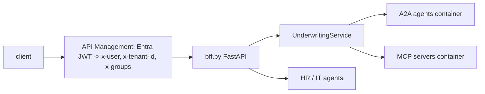

# BFF and services (`src/agentplatform/bff.py`, `services/`)

The FastAPI experience plane and the three container images: BFF, A2A agents and MCP servers.

**Sections:** [1. Purpose](#1-purpose) · [2. Architecture](#2-architecture) · [3. How it works](#3-how-it-works) · [4. Key files](#4-key-files) · [5. Code excerpts](#5-code-excerpts) · [6. Configuration](#6-configuration) · [7. Commands](#7-commands) · [8. Real output](#8-real-output) · [9. Tests and eval gates](#9-tests-and-eval-gates) · [10. Guardrails](#10-guardrails) · [11. Security and governance](#11-security-and-governance) · [12. Observability](#12-observability) · [13. Failure modes](#13-failure-modes) · [14. Mapping to Azure services](#14-mapping-to-azure-services) · [15. Limitations](#15-limitations) · [16. Interview talking points](#16-interview-talking-points) · [17. Adopt this](#17-adopt-this)

## 1. Purpose

One HTTP surface for clients, with identity from headers set by API Management, inbound safety screening and trace propagation, plus Dockerfiles that run each plane as its own Container App.

## 2. Architecture



## 3. How it works

1. `principal()` builds the caller from headers; `require()` checks group membership.
2. `underwrite` starts a run; `get_run` is tenant-scoped; `decide` requires the underwriting group and rejects a second decision.
3. `_screen` runs the safety gate on chat input.
4. Kill and revive routes flip the kill switch for operators.

## 4. Key files

| File | What it holds |
|---|---|
| `src/agentplatform/bff.py` | routes |
| `services/bff/Dockerfile` | BFF image |
| `services/a2a/Dockerfile` | A2A agents image |
| `services/mcp/Dockerfile` | MCP servers image |
| `docker-compose.yml`, `scripts/run_local_mesh.sh` | local multi-process runs |

## 5. Code excerpts

<!-- code: src/agentplatform/bff.py::underwrite -->
```python
@app.post("/loans/{loan_id}/underwrite")
async def underwrite(loan_id: str, request: Request, p: Principal = Depends(require("loan-officers"))):
    tp = traceparent(request)
    with span("bff.underwrite", tenant=p.tenant_id, loan=loan_id):
        rec = await underwriting_service().start(loan_id, p, tp)
    return {**rec.__dict__, "traceparent": tp}
```
<!-- /code -->

<!-- code: src/agentplatform/bff.py::_screen -->
```python
def _screen(text: str) -> None:
    verdict = get_safety_gate().check_inbound(text)
    if not verdict.allowed:
        raise HTTPException(400, {"error": "content_safety", "reasons": verdict.reasons})
```
<!-- /code -->

## 6. Configuration

All settings come from `Settings.from_env()` in `config.py`; on Azure they are azd outputs.

## 7. Commands

```bash
python scripts/component_demos.py bff
uvicorn agentplatform.bff:app --port 8080
make mesh        # each service as its own process
pytest tests/test_bff.py -q
```

## 8. Real output

<!-- output: python scripts/component_demos.py bff -->
```text
GET /healthz 200
POST /loans/L-1001/underwrite -> awaiting_underwriter
GET /runs/{id} from another tenant -> 404
decision by loan officer -> 403
decision by underwriter -> decision_issued approved_with_conditions
second decision -> 409
```
<!-- /output -->

## 9. Tests and eval gates

<!-- output: python -m pytest --co -q -p no:cacheprovider tests/test_bff.py | grep '::' -->
```text
tests/test_bff.py::test_underwrite_then_hitl_decision
tests/test_bff.py::test_unknown_loan_rejected
tests/test_bff.py::test_directory_and_admin_kill_switch
tests/test_bff.py::test_chat_endpoints_and_inbound_safety
```
<!-- /output -->

## 10. Guardrails

- Role checks on decisions; tenant scoping on reads; safety screening on chat.

## 11. Security and governance

- Headers are trusted only behind APIM, which validates the Entra token; offline defaults are for demos.
- Containers run as non-root with managed identity.

## 12. Observability

Incoming `traceparent` is honoured and propagated; `/healthz` is the probe.

## 13. Failure modes

| Failure | Status |
|---|---|
| unknown loan | 404 |
| other tenant | 404 |
| wrong role | 403 |
| second decision | 409 |

## 14. Mapping to Azure services

| Piece | Azure service |
|---|---|
| edge | API Management |
| runtime | Azure Container Apps |
| images | Azure Container Registry |

## 15. Limitations

- No UI; HTTP only.
- Header identity offline is a demo convenience.

## 16. Interview talking points

- Identity is resolved at the edge and enforced again in the app.

## 17. Adopt this

1. Add routes in `bff.py` using `principal()` and `require()`.
2. Keep APIM as the only path to the app in Azure.
