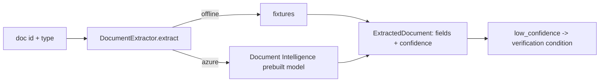

# Document intelligence (`src/agentplatform/docintel/`)

Prebuilt Azure AI Document Intelligence models for paystubs, W-2s and bank statements, with offline fixtures that return the same field shape and confidences.

**Sections:** [1. Purpose](#1-purpose) · [2. Architecture](#2-architecture) · [3. How it works](#3-how-it-works) · [4. Key files](#4-key-files) · [5. Code excerpts](#5-code-excerpts) · [6. Configuration](#6-configuration) · [7. Commands](#7-commands) · [8. Real output](#8-real-output) · [9. Tests and eval gates](#9-tests-and-eval-gates) · [10. Guardrails](#10-guardrails) · [11. Security and governance](#11-security-and-governance) · [12. Observability](#12-observability) · [13. Failure modes](#13-failure-modes) · [14. Mapping to Azure services](#14-mapping-to-azure-services) · [15. Limitations](#15-limitations) · [16. Interview talking points](#16-interview-talking-points) · [17. Adopt this](#17-adopt-this)

## 1. Purpose

Income and assets come from documents. The extractor returns typed fields with confidence, so low-confidence values become conditions instead of silent inputs.

## 2. Architecture



## 3. How it works

1. `PREBUILT_MODELS` maps a document type to a prebuilt model id.
2. `extract(doc_id, doc_type)` returns an `ExtractedDocument` with `FieldValue`s and confidences.
3. `low_confidence()` lists fields under the threshold; the workflow adds a verification condition for each (for example `C-DOC-L-1002-bank`).

## 4. Key files

| File | What it holds |
|---|---|
| `src/agentplatform/docintel/extractor.py` | extractor, models, fixtures |

## 5. Code excerpts

<!-- code: src/agentplatform/docintel/extractor.py::PREBUILT_MODELS -->
```python
PREBUILT_MODELS = {
    "paystub": "prebuilt-payStub.us",
    "w2": "prebuilt-tax.us.w2",
    "bank_statement": "prebuilt-bankStatement.us",
}
```
<!-- /code -->

<!-- code: src/agentplatform/docintel/extractor.py::DocumentExtractor.extract -->
```python
def extract(self, doc_id: str, doc_type: str, source: str | bytes | None = None) -> ExtractedDocument:
    model_id = PREBUILT_MODELS[doc_type]
    if self.fail_next > 0:
        self.fail_next -= 1
        from agentplatform.harness.resilience import TransientError

        raise TransientError("document intelligence: simulated 429")
    if not self.settings.azure:
        return self._fixture(doc_id, doc_type, model_id)
    return self._azure(doc_id, doc_type, model_id, source)
```
<!-- /code -->

## 6. Configuration

| Variable | Effect |
|---|---|
| `AZURE_DOCINTEL_ENDPOINT` | Document Intelligence resource (keyless) |

## 7. Commands

```bash
python scripts/component_demos.py docintel
pytest tests/test_knowledge.py -q -k docintel
```

## 8. Real output

<!-- output: python scripts/component_demos.py docintel -->
```text
L-1001-w2: model=prebuilt-tax.us.w2 fields=4 low_confidence=[]
L-1002-bank: model=prebuilt-bankStatement.us fields=6 low_confidence=['EndingBalance']
```
<!-- /output -->

## 9. Tests and eval gates

<!-- output: python -m pytest --co -q -p no:cacheprovider tests/test_knowledge.py::test_docintel_offline_returns_fields_and_confidence | grep '::' -->
```text
tests/test_knowledge.py::test_docintel_offline_returns_fields_and_confidence
```
<!-- /output -->

## 10. Guardrails

- Low-confidence fields are never used silently.
- Extraction runs under `FailurePolicy("intake", attempts=3)` with a circuit breaker; the `fail_next` hook simulates outages in tests.

## 11. Security and governance

- Documents stay in the tenant's storage; only fields are passed on.
- Account numbers are redacted before reaching prompts.

## 12. Observability

Extraction runs inside the income and assets node spans with the model id and page count.

## 13. Failure modes

| Failure | What happens |
|---|---|
| service error | intake retries up to 3 times behind the `docintel` circuit breaker, then the failure policy decides the exit |
| low confidence | verification condition |

## 14. Mapping to Azure services

| Piece | Azure service |
|---|---|
| extraction | Azure AI Document Intelligence (`prebuilt-tax.us.w2`, `prebuilt-bankStatement.us`, paystub model) |

## 15. Limitations

- Fixtures only; no real documents are processed.
- Confidence thresholds are illustrative.

## 16. Interview talking points

- Confidence is data: route it to a human-visible condition.

## 17. Adopt this

1. Add your document types to `PREBUILT_MODELS` (or a custom model id).
2. Add fixtures with the same field names for offline tests.
3. Map low-confidence fields to your review queue.
