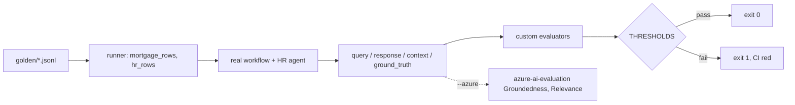

# Evals and release gate (`src/agentplatform/evals/`)

Golden sets, custom evaluators in the azure-ai-evaluation calling convention, and thresholds that fail CI on regression.

**Sections:** [1. Purpose](#1-purpose) · [2. Architecture](#2-architecture) · [3. How it works](#3-how-it-works) · [4. Key files](#4-key-files) · [5. Code excerpts](#5-code-excerpts) · [6. Configuration](#6-configuration) · [7. Commands](#7-commands) · [8. Real output](#8-real-output) · [9. Tests and eval gates](#9-tests-and-eval-gates) · [10. Guardrails](#10-guardrails) · [11. Security and governance](#11-security-and-governance) · [12. Observability](#12-observability) · [13. Failure modes](#13-failure-modes) · [14. Mapping to Azure services](#14-mapping-to-azure-services) · [15. Limitations](#15-limitations) · [16. Interview talking points](#16-interview-talking-points) · [17. Adopt this](#17-adopt-this)

## 1. Purpose

Make quality a release gate. The runner executes the real workflow and HR agent on golden cases, scores them with deterministic evaluators and exits non-zero when any metric falls below its threshold.

## 2. Architecture



## 3. How it works

1. `load_golden` reads the JSONL sets.
2. `mortgage_rows` and `hr_rows` run the targets and write rows with azure-ai-evaluation column names.
3. `score_offline` applies `PolicyComplianceEvaluator`, `ConditionRecallEvaluator`, `CitationEvaluator` and the others.
4. `EvalReport` compares each metric to `THRESHOLDS` and lists failures.

## 4. Key files

| File | What it holds |
|---|---|
| `src/agentplatform/evals/runner.py` | runner and thresholds |
| `src/agentplatform/evals/evaluators.py` | custom evaluators |
| `src/agentplatform/evals/golden/` | golden sets |
| `scripts/run_evals.py` | CLI used by CI |

## 5. Code excerpts

<!-- code: src/agentplatform/evals/runner.py::THRESHOLDS -->
```python
THRESHOLDS = {
    "policy_compliance": 1.0,
    "condition_recall": 0.95,
    "condition_leak": 0.0,  # max
    "recommendation_match": 1.0,
    "citation_exact": 0.8,
    "answer_contains": 0.8,
}
```
<!-- /code -->

<!-- code: src/agentplatform/evals/evaluators.py::PolicyComplianceEvaluator -->
```python
class PolicyComplianceEvaluator:
    """Mortgage policy gate: every condition cites a guideline that exists and was in force on the
    application date; the letter never carries adverse-action language (humans own adverse action)
    and never leaks SSNs."""

    id = "policy_compliance"

    def __init__(self) -> None:
        self._corpus = {c.id: c for c in load_corpus("guidelines")}

    def __call__(self, *, response: str, conditions: Any = None, as_of: str | None = None) -> dict[str, Any]:
        reasons: list[str] = []
        when = date.fromisoformat(as_of) if as_of else date.today()
        for c in _as_list(conditions):
            cites = c.get("guideline_ids") or []
            if not cites:
                reasons.append(f"{c['id']}: uncited")
            for g in cites:
                chunk = self._corpus.get(g)
                if chunk is None:
                    reasons.append(f"{c['id']}: unknown guideline {g}")
                elif not chunk.in_force(when):
                    reasons.append(f"{c['id']}: {g} not in force on {when}")
        if DENIAL.search(response or ""):
            reasons.append("adverse-action language in letter")
        if PII.search(response or ""):
            reasons.append("SSN pattern in letter")
        return {"policy_compliance": 0.0 if reasons else 1.0, "policy_compliance_reasons": reasons}
```
<!-- /code -->

## 6. Configuration

| Knob | Effect |
|---|---|
| `THRESHOLDS` | the gate |
| `--out` | where rows and the report are written |
| `--azure` | also run azure-ai-evaluation evaluators and log to Foundry |

## 7. Commands

```bash
python scripts/run_evals.py --out evals-out
pytest tests/test_evals.py -q
```

## 8. Real output

<!-- output: python scripts/run_evals.py --out /tmp/aap-evals-doc -->
```text
{
  "metrics": {
    "policy_compliance": 1.0,
    "condition_recall": 1.0,
    "condition_leak": 0.0,
    "recommendation_match": 1.0,
    "citation_exact": 1.0,
    "answer_contains": 1.0
  },
  "failures": []
}
```
<!-- /output -->

## 9. Tests and eval gates

<!-- output: python -m pytest --co -q -p no:cacheprovider tests/test_evals.py | grep '::' -->
```text
tests/test_evals.py::test_golden_sets_pass_release_gate
tests/test_evals.py::test_policy_evaluator_catches_violations
tests/test_evals.py::test_gate_fails_on_regression
tests/test_evals.py::test_custom_evaluator_runs_under_azure_ai_evaluation
tests/test_evals.py::test_search_index_definition_matches_query_contract
tests/test_evals.py::test_seed_script_dry_run
```
<!-- /output -->

## 10. Guardrails

- `condition_leak` must be 0: a condition not in the answer key fails the gate.
- A deliberate regression test proves the gate goes red.

## 11. Security and governance

- Golden data is synthetic.
- Thresholds change only by reviewed commit.

## 12. Observability

The report is a JSON artifact in CI (`evals-out`).

## 13. Failure modes

| Failure | What happens |
|---|---|
| metric below threshold | exit 1, CI fails |
| golden set malformed | load error, CI fails |

## 14. Mapping to Azure services

| Piece | Azure service |
|---|---|
| evaluation runs | Microsoft Foundry evaluations with azure-ai-evaluation |
| results | Foundry project |

## 15. Limitations

- Three loans and a few HR questions; small sets.
- The `--azure` path has not been run.

## 16. Interview talking points

- Gate on leaks as well as recall: an extra condition is a customer harm.

## 17. Adopt this

1. Add JSONL cases to `golden/`.
2. Write an evaluator with the keyword-in, dict-out convention.
3. Add its metric to `THRESHOLDS` and run `run_evals.py` in CI.
