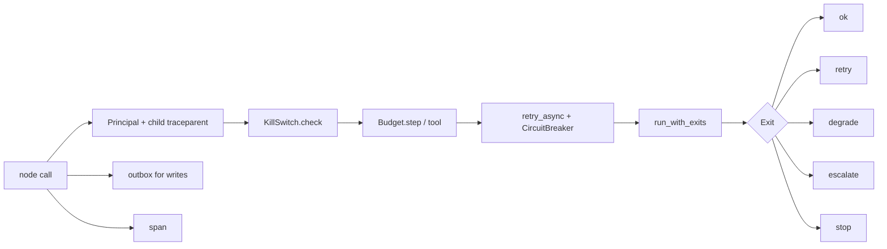

# Harness: identity, budgets, kill switch, resilience, five exits (`src/agentplatform/harness/`)

Everything that wraps an agent or node call but is neither the prompt nor the model.

**Sections:** [1. Purpose](#1-purpose) · [2. Architecture](#2-architecture) · [3. How it works](#3-how-it-works) · [4. Key files](#4-key-files) · [5. Code excerpts](#5-code-excerpts) · [6. Configuration](#6-configuration) · [7. Commands](#7-commands) · [8. Real output](#8-real-output) · [9. Tests and eval gates](#9-tests-and-eval-gates) · [10. Guardrails](#10-guardrails) · [11. Security and governance](#11-security-and-governance) · [12. Observability](#12-observability) · [13. Failure modes](#13-failure-modes) · [14. Mapping to Azure services](#14-mapping-to-azure-services) · [15. Limitations](#15-limitations) · [16. Interview talking points](#16-interview-talking-points) · [17. Adopt this](#17-adopt-this)

## 1. Purpose

Give every node the same identity and trace context, the same stop conditions and the same way to fail, so behaviour under stress is designed rather than accidental.

## 2. Architecture



## 3. How it works

1. `Principal` carries user, tenant, groups and the workload agent id; `child_traceparent` keeps the trace id per hop.
2. `KillSwitch.check(agent, tenant)` raises `AgentDisabled` for global, per-agent or per-tenant trips.
3. `Budget` limits steps, tool calls, identical calls, writes and cost.
4. `run_with_exits` maps each failure through `FAILURE_TABLE` to one of five exits.
5. Writes go through the outbox with idempotency keys.

## 4. Key files

| File | What it holds |
|---|---|
| `src/agentplatform/harness/budgets.py` | `Budget` |
| `src/agentplatform/harness/failure.py` | `FAILURE_TABLE`, `run_with_exits` |
| `src/agentplatform/harness/identity.py` | `Principal`, traceparent helpers |
| `src/agentplatform/harness/killswitch.py` | `KillSwitch` |
| `src/agentplatform/harness/outbox.py` | in-memory and Service Bus outboxes |
| `src/agentplatform/harness/resilience.py` | retry and circuit breaker |
| `src/agentplatform/harness/tracing.py` | OpenTelemetry setup and `span()` |
| `docs/failure-table.md` | rendered from `FAILURE_TABLE` by `scripts/render_docs.py` |

## 5. Code excerpts

<!-- code: src/agentplatform/harness/failure.py::run_with_exits -->
```python
async def run_with_exits(policy: FailurePolicy, fn: Callable[[], Awaitable[Any]]) -> NodeOutcome:
    try:
        value, retries = await retry_async(
            fn,
            attempts=policy.attempts,
            timeout_s=policy.timeout_s,
            breaker=policy.breaker,
            retry_on=policy.retry_on,
        )
        return NodeOutcome(policy.node, Exit.RETRY if retries else Exit.SUCCESS, value, retries)
    except (BudgetExceeded, AgentDisabled) as exc:  # stop conditions are never retried or degraded
        return NodeOutcome(policy.node, Exit.ESCALATE, reason=str(exc))
    except Exception as exc:
        if policy.compensate is not None:
            await policy.compensate(exc)
            return NodeOutcome(policy.node, Exit.COMPENSATE, reason=f"compensated after: {exc!r}")
        if policy.degrade is not None:
            reason = "circuit open" if isinstance(exc, CircuitOpen) else repr(exc)
            return NodeOutcome(policy.node, Exit.DEGRADE, await policy.degrade(exc), reason=reason)
        return NodeOutcome(policy.node, Exit.ESCALATE, reason=repr(exc))
```
<!-- /code -->

<!-- code: src/agentplatform/harness/budgets.py::Budget.tool -->
```python
def tool(self, name: str, args: dict | None = None, *, write: bool = False) -> None:
    self.tool_calls += 1
    if self.tool_calls > self.max_tool_calls:
        raise BudgetExceeded("max_tool_calls", name)
    key = f"{name}:{json.dumps(args or {}, sort_keys=True, default=str)}"
    self._seen[key] = self._seen.get(key, 0) + 1
    if self._seen[key] > self.max_identical_calls:
        raise BudgetExceeded("max_identical_calls", key)
    if write:
        self.writes += 1
        if self.writes > self.max_writes:
            raise BudgetExceeded("max_writes", name)
```
<!-- /code -->

## 6. Configuration

| Variable | Effect |
|---|---|
| `APPLICATIONINSIGHTS_CONNECTION_STRING` | export spans to Azure Monitor |
| `AAP_TRACE_CONSOLE=1` | print spans locally |
| `AZURE_SERVICEBUS_NAMESPACE` | Service Bus outbox |

## 7. Commands

```bash
python scripts/component_demos.py harness
python scripts/render_docs.py --check
pytest tests/test_harness.py -q
```

## 8. Real output

<!-- output: python scripts/component_demos.py harness -->
```text
budget: max_identical_calls
failure table rows: 8
```
<!-- /output -->

## 9. Tests and eval gates

<!-- output: python -m pytest --co -q -p no:cacheprovider tests/test_harness.py | grep '::' -->
```text
tests/test_harness.py::test_budget_stops_identical_calls_and_writes
tests/test_harness.py::test_traceparent_propagation_keeps_trace_id
tests/test_harness.py::test_kill_switch_scopes
tests/test_harness.py::test_five_exits
tests/test_harness.py::test_circuit_breaker_opens_then_degrades
tests/test_harness.py::test_failure_table_has_five_exits_per_node
tests/test_harness.py::test_prompt_pack_versioned_and_schema_bound
tests/test_harness.py::test_safety_gate_blocks_injection_offline
tests/test_harness.py::test_mock_client_returns_structured_draft
```
<!-- /output -->

## 10. Guardrails

- Identical repeated tool calls and extra writes stop the run.
- A kill switch is checked between every node.
- Every failure has exactly one named exit; the table completeness is tested.

## 11. Security and governance

- Identity and tenant are on every span and every write.
- The failure table is reviewable data, rendered into the docs.

## 12. Observability

`span()` adds tenant, thread, node, tool, token, cost and identity attributes; `configure_tracing()` wires Azure Monitor.

## 13. Failure modes

See [`docs/failure-table.md`](../failure-table.md), generated from `FAILURE_TABLE`.

## 14. Mapping to Azure services

| Piece | Azure service |
|---|---|
| traces | Application Insights via Azure Monitor OpenTelemetry |
| outbox | Azure Service Bus |
| kill switch at the edge | API Management named value |

## 15. Limitations

- Kill switch and budgets are in-process state; a fleet needs a shared store.

## 16. Interview talking points

- Five exits make failure handling reviewable: every row says what the user sees.

## 17. Adopt this

1. Wrap node bodies with `run_with_exits` and add rows to `FAILURE_TABLE`.
2. Create a `Budget` per run.
3. Call `configure_tracing()` at start-up.
