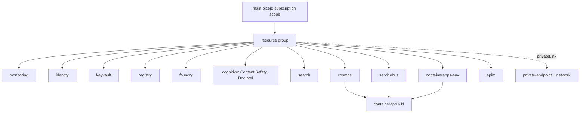

# Infrastructure (`infra/`, `azure.yaml`, workflows)

Bicep for `azd up` and an equivalent Terraform stack, a cost-minimal default profile and optional Private Link. Defined and validated in CI; not deployed.

**Sections:** [1. Purpose](#1-purpose) · [2. Architecture](#2-architecture) · [3. How it works](#3-how-it-works) · [4. Key files](#4-key-files) · [5. Code excerpts](#5-code-excerpts) · [6. Configuration](#6-configuration) · [7. Commands](#7-commands) · [8. Real output](#8-real-output) · [9. Tests and eval gates](#9-tests-and-eval-gates) · [10. Guardrails](#10-guardrails) · [11. Security and governance](#11-security-and-governance) · [12. Observability](#12-observability) · [13. Failure modes](#13-failure-modes) · [14. Mapping to Azure services](#14-mapping-to-azure-services) · [15. Limitations](#15-limitations) · [16. Interview talking points](#16-interview-talking-points) · [17. Adopt this](#17-adopt-this)

## 1. Purpose

Show that the platform has a reproducible, reviewable landing: every service the code expects is declared, keyless, and validated offline.

## 2. Architecture



## 3. How it works

1. `azure.yaml` maps the three services to Container Apps.
2. `main.bicep` creates the resource group and composes one module per resource type, with the `cost-min` profile by default.
3. `roles.bicep` grants the workload identity data-plane roles; local auth is disabled on data services.
4. `infra/terraform` mirrors the same design with plan tests that use mocked providers.
5. CI builds the Bicep; the `infra` workflow runs `terraform fmt`, `validate`, `test`, tflint and checkov. Deploy and teardown workflows exist but need Azure credentials and are not run.

## 4. Key files

| File | What it holds |
|---|---|
| `infra/main.bicep` | entry point and profiles |
| `infra/modules/*.bicep` | one module per resource type |
| `infra/terraform/` | Terraform equivalent |
| `.github/workflows/infra.yml`, `deploy.yml`, `teardown.yml` | validation, gated deploy, teardown |
| `tests/test_infra.py` | static checks |

## 5. Code excerpts

Cost profiles in `main.bicep`:

<!-- code: infra/main.bicep:56-60 -->
```bicep
var profiles = {
  'cost-min': { apim: 'Consumption', search: 'basic', serviceBus: 'Basic', minReplicas: 0, logQuotaGb: 1 }
  standard: { apim: 'Developer', search: 'standard', serviceBus: 'Standard', minReplicas: 1, logQuotaGb: -1 }
}
var p = profiles[costProfile]
```
<!-- /code -->

Least-privilege grant for the orchestrator identity (`roles.bicep`):

<!-- code: infra/modules/roles.bicep:41-46 -->
```bicep
// ---- orchestrator (BFF + underwriting agent) ----
resource o1 'Microsoft.Authorization/roleAssignments@2022-04-01' = {
  scope: foundry
  name: ra(foundry.id, orchestratorPrincipalId, role.foundryUser)
  properties: { principalId: orchestratorPrincipalId, principalType: 'ServicePrincipal', roleDefinitionId: subscriptionResourceId('Microsoft.Authorization/roleDefinitions', role.foundryUser) }
}
```
<!-- /code -->

## 6. Configuration

Parameters in `infra/main.parameters.json`: `environmentName`, `location`, `principalId`, `costProfile` (`cost-min` or `standard`), `privateLink`, `deployVendorStandins`, model names and capacity.

## 7. Commands

```bash
az bicep build --file infra/main.bicep --stdout > /dev/null
pytest tests/test_infra.py -q
terraform -chdir=infra/terraform init -backend=false && terraform -chdir=infra/terraform test
```

## 8. Real output

<!-- output: ls infra/modules -->
```text
README.md
apim.bicep
cognitive.bicep
containerapp.bicep
containerapps-env.bicep
cosmos.bicep
foundry.bicep
identity.bicep
keyvault.bicep
monitoring.bicep
network.bicep
private-endpoint.bicep
registry.bicep
roles.bicep
search.bicep
servicebus.bicep
```
<!-- /output -->

<!-- output: python -m pytest --co -q -p no:cacheprovider tests/test_infra.py | grep '::' -->
```text
tests/test_infra.py::test_azure_yaml_services_match_container_app_tags
tests/test_infra.py::test_cost_min_is_default_and_private_link_off
tests/test_infra.py::test_no_local_auth_on_data_services
tests/test_infra.py::test_bicep_builds_cleanly
```
<!-- /output -->

## 9. Tests and eval gates

`tests/test_infra.py` checks service tags, the default profile, disabled local auth and that Bicep builds (skipped where `az` is missing). Terraform plan tests run in the `infra` workflow.

## 10. Guardrails

- Cheapest SKUs by default; scale to zero.
- Deploy is a manual, gated workflow.

## 11. Security and governance

- Managed identity everywhere; local auth disabled on Cosmos DB, Service Bus, Search and Cognitive Services.
- Private endpoints with `privateLink=true`.

## 12. Observability

Log Analytics and Application Insights are provisioned first and wired into every app.

## 13. Failure modes

| Failure | What happens |
|---|---|
| Bicep error | CI fails |
| Terraform drift from Bicep | reviewed manually; both are validated |

## 14. Mapping to Azure services

Container Apps, API Management, Microsoft Foundry, Azure AI Search, Content Safety, Document Intelligence, Cosmos DB, Service Bus, Key Vault, Container Registry, Log Analytics, Application Insights, Private Link.

## 15. Limitations

- Never deployed from this repository; costs are estimates in `docs/cost-estimate.md`.

## 16. Interview talking points

- Two IaC flavours of the same design, both tested offline.

## 17. Adopt this

1. Copy `infra/` and edit `main.parameters.json`.
2. Keep `roles.bicep` as the single place for data-plane grants.
3. Run `azd up` in a sandbox subscription when ready.
