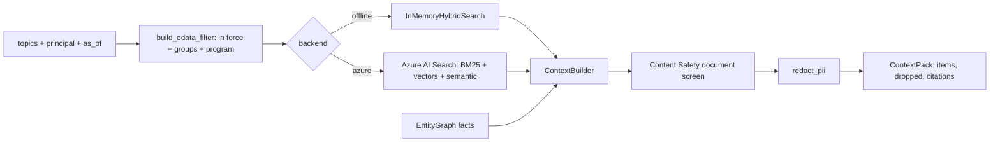

# Knowledge and context (`src/agentplatform/knowledge/`, `src/agentplatform/context/`)

Temporal, security-trimmed hybrid retrieval with a small entity graph, and the context builder that turns hits into a cited, screened, budgeted evidence pack.

**Sections:** [1. Purpose](#1-purpose) · [2. Architecture](#2-architecture) · [3. How it works](#3-how-it-works) · [4. Key files](#4-key-files) · [5. Code excerpts](#5-code-excerpts) · [6. Configuration](#6-configuration) · [7. Commands](#7-commands) · [8. Real output](#8-real-output) · [9. Tests and eval gates](#9-tests-and-eval-gates) · [10. Guardrails](#10-guardrails) · [11. Security and governance](#11-security-and-governance) · [12. Observability](#12-observability) · [13. Failure modes](#13-failure-modes) · [14. Mapping to Azure services](#14-mapping-to-azure-services) · [15. Limitations](#15-limitations) · [16. Interview talking points](#16-interview-talking-points) · [17. Adopt this](#17-adopt-this)

## 1. Purpose

Underwriting must use the guideline version in force on the application date and only what the caller may see. The knowledge plane enforces both in the search filter; the context builder adds injection screening, PII redaction and citations.

## 2. Architecture



## 3. How it works

1. `build_odata_filter(as_of, groups, program)` builds the temporal and ACL filter that is pushed down to the search service.
2. `InMemoryHybridSearch` applies the same semantics offline; `AzureAISearchBackend` sends the filter with a hybrid query.
3. `ContextBuilder.build` retrieves per topic, adds graph facts for related-party checks and tool facts, screens every passage for indirect injection and redacts PII.
4. Dropped passages are listed with a reason; if search is down, `build_from_cache` returns a pack marked `limited`.

## 4. Key files

| File | What it holds |
|---|---|
| `src/agentplatform/knowledge/search.py` | filter, backends, `Chunk.in_force` |
| `src/agentplatform/knowledge/index_schema.py` | AI Search index definition |
| `src/agentplatform/knowledge/graph.py` | `EntityGraph`, citable edges |
| `src/agentplatform/context/builder.py` | `ContextBuilder`, `ContextPack` |
| `scripts/seed_search_index.py` | index creation and upload (dry-run offline) |

## 5. Code excerpts

<!-- code: src/agentplatform/knowledge/search.py::build_odata_filter -->
```python
def build_odata_filter(as_of: date, groups: frozenset[str], program: str | None = None) -> str:
    """Temporal validity + security trimming, pushed down to Azure AI Search."""
    ts = f"{as_of.isoformat()}T00:00:00Z"
    safe_groups = ",".join(sorted(g.replace("'", "''") for g in groups))
    parts = [
        f"effective_from le {ts}",
        f"(effective_to eq null or effective_to ge {ts})",
        f"allowed_groups/any(g: search.in(g, '{safe_groups}', ','))",
    ]
    if program:
        parts.append(f"program eq '{program.replace(chr(39), chr(39) * 2)}'")
    return " and ".join(parts)
```
<!-- /code -->

<!-- code: src/agentplatform/context/builder.py::ContextBuilder.build -->
```python
def build(
    self,
    *,
    topics: list[str],
    principal: Principal,
    as_of: date,
    program: str | None = None,
    graph_anchor: str | None = None,
    tool_facts: dict[str, str] | None = None,
    top_per_topic: int = 3,
) -> ContextPack:
    pack = ContextPack(as_of=as_of)
    with span("context.build", tenant=principal.tenant_id, topics=len(topics), as_of=as_of.isoformat()):
        chunks: dict[str, Chunk] = {}
        for topic in topics:
            pack.queries.append(topic)
            q = SearchQuery(topic, as_of, principal.groups, top=top_per_topic, program=program)
            for hit in self.search.search(q):  # SearchUnavailable propagates to the harness
                chunks.setdefault(hit.chunk.id, hit.chunk)
        self._pack_guidelines(pack, list(chunks.values()), principal, as_of)
        self._pack_graph(pack, graph_anchor)
        self._pack_tools(pack, tool_facts or {})
    return pack
```
<!-- /code -->

## 6. Configuration

| Variable | Effect |
|---|---|
| `AZURE_SEARCH_ENDPOINT` | AI Search service |
| `AZURE_SEARCH_GUIDELINES_INDEX`, `AZURE_SEARCH_HR_INDEX` | index names |
| `AZURE_OPENAI_ENDPOINT`, `AZURE_OPENAI_EMBEDDING_DEPLOYMENT` | integrated vectorizer |
| `top_per_topic` | hits kept per topic |

## 7. Commands

```bash
python scripts/component_demos.py knowledge
python scripts/component_demos.py context
python scripts/seed_search_index.py --dry-run
pytest tests/test_knowledge.py -q
```

## 8. Real output

<!-- output: python scripts/component_demos.py knowledge -->
```text
as_of=2025-03-10 top=GL-DTI-200.v1
as_of=2025-09-15 top=GL-DTI-200.v2
filter: effective_from le 2025-09-15T00:00:00Z and (effective_to eq null or effective_to ge 2025-09-15T00:00:00Z) and allowed_groups/any(g: search.in(g, 'underwriting', ',')) and program eq 'conventional'
related-party path sources: ['VOE-1003', 'SOS-REG-7781']
```
<!-- /output -->

<!-- output: python scripts/component_demos.py context -->
```text
guidelines: ['GL-CR-140', 'GL-CR-140.v1', 'GL-DTI-200', 'GL-DTI-200.v2']
graph: ['VOE-1003', 'CRM-CONTACT-3301', 'SOS-REG-7781']
dropped: [('GL-MISC-999.v1', 'injection')]
ssn visible in render: False
redact: account ****7890 ssn ***-**-****
```
<!-- /output -->

## 9. Tests and eval gates

<!-- output: python -m pytest --co -q -p no:cacheprovider tests/test_knowledge.py | grep '::' -->
```text
tests/test_knowledge.py::test_temporal_rag_returns_version_in_force
tests/test_knowledge.py::test_security_filter_hides_confidential_overlay
tests/test_knowledge.py::test_hybrid_scores_have_semantic_reranker_range
tests/test_knowledge.py::test_odata_filter_matches_azure_syntax
tests/test_knowledge.py::test_context_builder_drops_injection_and_cites
tests/test_knowledge.py::test_context_builder_degrades_to_cache
tests/test_knowledge.py::test_graph_rag_detects_non_arms_length
tests/test_knowledge.py::test_docintel_offline_returns_fields_and_confidence
tests/test_knowledge.py::test_redaction
```
<!-- /output -->

The eval gate's `citation_exact` and `policy_compliance` metrics depend on this pack.

## 10. Guardrails

- Filters are applied by the search service, not by the model.
- A passage carrying injected instructions is dropped and recorded (`GL-MISC-999.v1` in the output).
- PII is redacted before text is packed.

## 11. Security and governance

- `allowed_groups` is a filterable field and every query is trimmed to the caller's groups.
- Confidential overlays are invisible to callers outside the group (tested).

## 12. Observability

`context.build` spans record tenant, topic count and as-of date; the pack records queries, dropped items and tokens used.

## 13. Failure modes

| Failure | What happens |
|---|---|
| search unavailable | `SearchUnavailable` (retryable), then a cached pack marked `limited` |
| no in-force guideline | no citation, so the critic fails closed |
| poisoned passage | dropped with reason `injection` |

## 14. Mapping to Azure services

| Piece | Azure service |
|---|---|
| index | Azure AI Search with semantic configuration `default` |
| vectors | Azure OpenAI embedding deployment via integrated vectorizer |
| screening | Azure AI Content Safety Prompt Shields (documents) |

## 15. Limitations

- The offline embedding is hashed, not semantic.
- The graph is a handful of synthetic nodes.

## 16. Interview talking points

- Temporal RAG: the right answer depends on the date the decision is about, not today.
- Security trimming in the query is the only trimming that can be trusted.

## 17. Adopt this

1. Add `effective_from`, `effective_to` and `allowed_groups` to your index (copy `index_schema.py`).
2. Use `build_odata_filter` for every query.
3. Build packs with `ContextBuilder` and make your critic require citations from `pack.ids()`.
