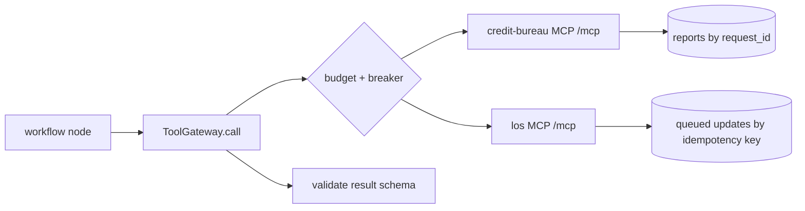

# MCP tool plane (`src/agentplatform/mcp_servers/`)

Small Model Context Protocol servers in front of the credit bureau and the loan origination system, and the gateway agents use to reach them.

**Sections:** [1. Purpose](#1-purpose) · [2. Architecture](#2-architecture) · [3. How it works](#3-how-it-works) · [4. Key files](#4-key-files) · [5. Code excerpts](#5-code-excerpts) · [6. Configuration](#6-configuration) · [7. Commands](#7-commands) · [8. Real output](#8-real-output) · [9. Tests and eval gates](#9-tests-and-eval-gates) · [10. Guardrails](#10-guardrails) · [11. Security and governance](#11-security-and-governance) · [12. Observability](#12-observability) · [13. Failure modes](#13-failure-modes) · [14. Mapping to Azure services](#14-mapping-to-azure-services) · [15. Limitations](#15-limitations) · [16. Interview talking points](#16-interview-talking-points) · [17. Adopt this](#17-adopt-this)

## 1. Purpose

Systems of record should expose a narrow, idempotent tool surface to agents. The credit bureau has two tools and the LOS has two, one of which is a queued write keyed by an idempotency key.

## 2. Architecture



## 3. How it works

1. Each server is an `mcp` 2.x server over streamable HTTP, started with `python -m agentplatform.mcp_servers <name>`.
2. `pull_tri_merge` checks permissible purpose and consent, and reusing a `request_id` returns the same report without a second hard pull.
3. `queue_status_update` only accepts allowed statuses and returns the same ticket for the same idempotency key.
4. `ToolGateway.call` applies budgets and circuit breakers, traces the call and maps an unreachable server to `TransientError` so the failure policy can retry or degrade.

## 4. Key files

| File | What it holds |
|---|---|
| `src/agentplatform/mcp_servers/credit_bureau.py` | bureau tools |
| `src/agentplatform/mcp_servers/los.py` | LOS tools |
| `src/agentplatform/mcp_servers/gateway.py` | `ToolGateway` |
| `src/agentplatform/mcp_servers/__main__.py` | server entry point |
| `services/mcp/Dockerfile` | container image |

## 5. Code excerpts

<!-- code: src/agentplatform/mcp_servers/los.py::queue_status_update -->
```python
@server.tool()
def queue_status_update(loan_id: str, status: str, idempotency_key: str) -> dict:
    """Queue an LOS status change. Same idempotency_key -> same ticket (no double post)."""
    if status not in {"conditionally_approved", "suspended", "in_review"}:
        return {"error": "status_not_allowed", "status": status}
    if idempotency_key not in QUEUED:
        QUEUED[idempotency_key] = {
            "ticket": f"LOS-Q-{len(QUEUED) + 1:04d}",
            "loan_id": loan_id,
            "status": status,
        }
    return QUEUED[idempotency_key]
```
<!-- /code -->

<!-- code: src/agentplatform/mcp_servers/gateway.py::ToolGateway.call -->
```python
async def call(
    self,
    server: str,
    tool: str,
    args: dict[str, Any],
    *,
    schema: type[BaseModel] | None = None,
    write: bool = False,
    tenant: str | None = None,
) -> dict[str, Any]:
    self.budget.tool(f"{server}.{tool}", args, write=write)
    with span("tool.call", server=server, tool=tool, write=write, tenant=tenant):
        try:
            async with Client(_server_target(server)) as c:
                result = await c.call_tool(tool, args)
        except Exception as exc:  # transport failures surface as (nested) ExceptionGroups from anyio
            if _is_transport_error(exc):
                raise TransientError(f"{server}.{tool}: unreachable ({type(exc).__name__})") from exc
            raise
        if result.is_error:
            text = " ".join(getattr(x, "text", "") for x in result.content)
            if "TRANSIENT" in text or "timeout" in text.lower():
                raise TransientError(f"{server}.{tool}: {text}")
            raise ToolError(f"{server}.{tool}: {text}")
        payload = result.structured_content or json.loads(result.content[0].text)
        if isinstance(payload, dict) and payload.get("error"):
            raise ToolError(f"{server}.{tool}: {payload['error']}")
        return schema.model_validate(payload).model_dump() if schema else payload
```
<!-- /code -->

## 6. Configuration

| Variable | Effect |
|---|---|
| `MCP_SERVER` | `credit-bureau` or `los` |
| `PORT` | listen port (default 8080) |

## 7. Commands

```bash
python scripts/component_demos.py mcp
PORT=9101 python -m agentplatform.mcp_servers credit-bureau
pytest tests/test_mcp.py -q
```

## 8. Real output

<!-- output: python scripts/component_demos.py mcp -->
```text
representative score: 742
hard pulls for two calls: 1 same report: True
ticket: LOS-Q-0001 same ticket on retry: True
denied status: {'error': 'status_not_allowed', 'status': 'denied'}
```
<!-- /output -->

## 9. Tests and eval gates

<!-- output: python -m pytest --co -q -p no:cacheprovider tests/test_mcp.py | grep '::' -->
```text
tests/test_mcp.py::test_mcp_tool_surface_is_small_and_read_only
tests/test_mcp.py::test_gateway_idempotent_pull_and_transient_mapping
tests/test_mcp.py::test_gateway_budget_and_errors
tests/test_mcp.py::test_los_queue_is_idempotent
tests/test_mcp.py::test_unreachable_mcp_server_maps_to_transient
```
<!-- /output -->

## 10. Guardrails

- No consent, no pull; wrong permissible purpose, no pull.
- Statuses outside the allowed set (for example a denial) are rejected.
- Duplicate requests are absorbed by request ids and idempotency keys.

## 11. Security and governance

- The tool surface is the contract; adding a tool is a reviewed change.
- Bureau data is synthetic and contains no real identifiers.

## 12. Observability

Gateway spans carry tool name, server, outcome and latency; hard pulls are counted in `STATS`.

## 13. Failure modes

| Failure | What happens |
|---|---|
| server unreachable | `TransientError`, retried then degraded |
| simulated bureau timeout | retry with the same request id, still one hard pull |
| budget exceeded | `BudgetExceeded`, the run stops with a named exit |

## 14. Mapping to Azure services

| Piece | Azure service |
|---|---|
| servers | Azure Container Apps |
| edge | API Management in front of `/mcp` |
| identity | managed identity per server |

## 15. Limitations

- Both systems are mocks with in-memory state.
- No authentication on the local servers; Azure relies on APIM and network rules.

## 16. Interview talking points

- Idempotency belongs in the tool contract, not in the prompt.
- Small tool surfaces are easier to review, test and secure.

## 17. Adopt this

1. Copy `los.py` as a template for a system-of-record server.
2. Give every write an idempotency key and an allowed-values check.
3. Route calls through `ToolGateway` so budgets and breakers apply.
