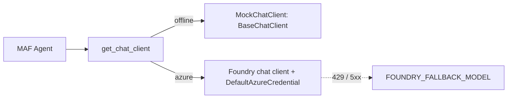

# Model clients (`src/agentplatform/llm/`)

A deterministic MAF chat client offline and a Foundry chat client with a fallback deployment on Azure.

**Sections:** [1. Purpose](#1-purpose) · [2. Architecture](#2-architecture) · [3. How it works](#3-how-it-works) · [4. Key files](#4-key-files) · [5. Code excerpts](#5-code-excerpts) · [6. Configuration](#6-configuration) · [7. Commands](#7-commands) · [8. Real output](#8-real-output) · [9. Tests and eval gates](#9-tests-and-eval-gates) · [10. Guardrails](#10-guardrails) · [11. Security and governance](#11-security-and-governance) · [12. Observability](#12-observability) · [13. Failure modes](#13-failure-modes) · [14. Mapping to Azure services](#14-mapping-to-azure-services) · [15. Limitations](#15-limitations) · [16. Interview talking points](#16-interview-talking-points) · [17. Adopt this](#17-adopt-this)

## 1. Purpose

Every agent gets its client from `get_chat_client()`, so tests run without a model and Azure runs use managed identity and a fallback deployment, with no code change.

## 2. Architecture



## 3. How it works

1. `MockChatClient` subclasses MAF's `BaseChatClient`, so tools, structured output and middleware run as they would against Foundry.
2. Answers are deterministic per prompt, which makes the evals and tests stable.
3. With `AAP_MODE=azure`, `get_chat_client()` builds a Foundry client over the project endpoint using `azure_credential()` (managed identity).

## 4. Key files

| File | What it holds |
|---|---|
| `src/agentplatform/llm/clients.py` | `MockChatClient`, `get_chat_client` |
| `src/agentplatform/config.py` | `Settings`, `azure_credential` |

## 5. Code excerpts

<!-- code: src/agentplatform/llm/clients.py::get_chat_client -->
```python
def get_chat_client(settings: Settings | None = None, *, fallback: bool = False) -> BaseChatClient:
    s = settings or get_settings()
    if not s.azure:
        return MockChatClient()
    from agent_framework_foundry import FoundryChatClient

    model = s.foundry_fallback_model if (fallback and s.foundry_fallback_model) else s.foundry_model
    return FoundryChatClient(
        project_endpoint=s.foundry_project_endpoint,
        model=model,
        credential=azure_credential(s),
    )
```
<!-- /code -->

<!-- code: src/agentplatform/config.py::azure_credential -->
```python
def azure_credential(settings: Settings | None = None):
    """Managed identity in Container Apps (AZURE_CLIENT_ID = user-assigned MI), dev creds locally.

    Never keys: every Bicep resource disables local auth where the service allows it.
    """
    from azure.identity import DefaultAzureCredential

    s = settings or get_settings()
    return DefaultAzureCredential(managed_identity_client_id=s.managed_identity_client_id or None)
```
<!-- /code -->

## 6. Configuration

| Variable | Effect |
|---|---|
| `FOUNDRY_PROJECT_ENDPOINT` | Foundry project |
| `FOUNDRY_MODEL` | primary deployment |
| `FOUNDRY_FALLBACK_MODEL` | fallback deployment |
| `AZURE_CLIENT_ID` | user-assigned managed identity |

## 7. Commands

```bash
python scripts/component_demos.py llm
pytest tests/test_harness.py -q -k mock_client
```

## 8. Real output

<!-- output: python scripts/component_demos.py llm -->
```text
mode: offline client: MockChatClient
structured output: {'summary': 'Reserves meet the guideline.', 'citations': ['GL-AST-220.v1']}
```
<!-- /output -->

## 9. Tests and eval gates

Every test and the eval gate run on `MockChatClient`; the harness tests include the structured-output case.

## 10. Guardrails

- Offline is the default; nothing calls a paid model unless `AAP_MODE=azure`.
- Fallback, then deterministic draft, so a model outage does not stop a run.

## 11. Security and governance

- Keyless: the orchestrator identity gets the Foundry User (formerly Azure AI User) and Cognitive Services OpenAI User roles in `roles.bicep`; no API keys in configuration.

## 12. Observability

Model calls carry token counts and the deployment name on the node span.

## 13. Failure modes

| Failure | What happens |
|---|---|
| primary throttled | fallback deployment |
| both fail | deterministic draft, run continues to the critic |

## 14. Mapping to Azure services

| Piece | Azure service |
|---|---|
| models | Microsoft Foundry deployments |
| identity | managed identity |

## 15. Limitations

- The Foundry path has not been exercised against a live project.

## 16. Interview talking points

- A real `BaseChatClient` mock exercises the framework, not a stub.

## 17. Adopt this

1. Build agents with `get_chat_client()`.
2. Extend `MockChatClient` replies for your prompts so tests stay deterministic.
