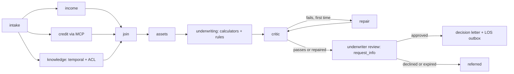

# Mortgage underwriting workflow (`src/agentplatform/mortgage/`)

The flagship: a Microsoft Agent Framework (MAF) workflow that turns a synthetic loan file into cited underwriting conditions, pauses for an underwriter, and only then drafts the letter and queues system-of-record writes.

**Sections:** [1. Purpose](#1-purpose) · [2. Architecture](#2-architecture) · [3. How it works](#3-how-it-works) · [4. Key files](#4-key-files) · [5. Code excerpts](#5-code-excerpts) · [6. Configuration](#6-configuration) · [7. Commands](#7-commands) · [8. Real output](#8-real-output) · [9. Tests and eval gates](#9-tests-and-eval-gates) · [10. Guardrails](#10-guardrails) · [11. Security and governance](#11-security-and-governance) · [12. Observability](#12-observability) · [13. Failure modes](#13-failure-modes) · [14. Mapping to Azure services](#14-mapping-to-azure-services) · [15. Limitations](#15-limitations) · [16. Interview talking points](#16-interview-talking-points) · [17. Adopt this](#17-adopt-this)

## 1. Purpose

Show a multi-agent graph in a regulated domain where the model drafts and explains, deterministic code does the money math and the citation checks, and a named human makes the decision. Each loan run is durable, so it can wait at the human checkpoint for hours and resume after a restart.

## 2. Architecture



## 3. How it works

1. `UnderwritingService.start(loan_id, principal)` creates a run id, a child `traceparent` and a checkpointed MAF workflow from `build_workflow()`.
2. Intake loads the loan file from the LOS MCP server and fans out to income (Document Intelligence fields), credit (tri-merge over MCP with a stable request id) and knowledge (guideline versions in force on the application date, trimmed to the caller's groups, plus graph facts).
3. The join executor merges evidence; assets and underwriting run the deterministic calculators (`monthly_pi`, `qualifying_income`, `asset_position`, `dti`) and `rules.evaluate()` turns the numbers and guideline params into a recommendation and draft conditions.
4. The critic (`critic.check`) fails closed unless every condition cites an in-force guideline present in the evidence pack; one repair pass is allowed.
5. `UnderwriterReviewExecutor` calls `request_info`, the run is checkpointed (files offline, Cosmos DB on Azure) and the service returns `awaiting_underwriter`.
6. `decide(run_id, decision)` resumes from the checkpoint. Approval drafts the letter and queues the LOS status update through the outbox with an idempotency key; a decline or an expired review refers the file.

## 4. Key files

| File | What it holds |
|---|---|
| `src/agentplatform/mortgage/workflow.py` | executors and `build_workflow()` |
| `src/agentplatform/mortgage/service.py` | `UnderwritingService` (`start`, `decide`, `resume`, `expire_reviews`) and checkpoint storage |
| `src/agentplatform/mortgage/calculators.py` | the money math; the model never computes numbers |
| `src/agentplatform/mortgage/rules.py` | `topics_for` and `evaluate` |
| `src/agentplatform/mortgage/critic.py` | fail-closed citation checks |
| `src/agentplatform/mortgage/agents.py` | `AgentSuite`: one MAF `Agent` per role, bound to the prompt pack schemas |
| `src/agentplatform/mortgage/data/loans.json` | synthetic LOS, bureau and CRM records |
| `tests/test_mortgage_workflow.py` | end to end, HITL, resume, chaos and audit tests |

## 5. Code excerpts

The graph:

<!-- code: src/agentplatform/mortgage/workflow.py::build_workflow -->
```python
def build_workflow(
    deps: Deps, *, run_name: str, checkpoint_storage: CheckpointStorage | None = None
) -> Workflow:
    intake = IntakeExecutor(deps)
    income, credit, knowledge = IncomeExecutor(deps), CreditExecutor(deps), KnowledgeExecutor(deps)
    join, assets, uw = JoinExecutor(deps), AssetsExecutor(deps), UnderwritingExecutor(deps)
    crit, repair = CriticExecutor(deps), RepairExecutor(deps)
    review, letter = UnderwriterReviewExecutor(deps), DecisionLetterExecutor(deps)
    return (
        WorkflowBuilder(
            start_executor=intake,
            checkpoint_storage=checkpoint_storage,
            name=run_name,  # per-run name -> per-run checkpoint partition (Cosmos pk = workflow_name)
            description="Mortgage underwriting conditions (MAF graph)",
            max_iterations=40,
        )
        .add_fan_out_edges(intake, [income, credit, knowledge])
        .add_fan_in_edges([income, credit, knowledge], join)
        .add_edge(join, assets)
        .add_edge(assets, uw)
        .add_edge(uw, crit)
        .add_switch_case_edge_group(
            crit,
            [
                Case(condition=lambda s: bool(s.critic.get("needs_repair")), target=repair),
                Default(target=review),
            ],
        )
        .add_edge(repair, crit)
        .add_edge(review, letter)
        .build()
    )
```
<!-- /code -->

The critic that blocks uncited conditions:

<!-- code: src/agentplatform/mortgage/critic.py::check -->
```python
def check(conditions: list[dict], pack: ContextPack, as_of: date) -> dict:
    ids_in_pack = pack.guideline_ids()
    uncited, not_in_evidence, not_in_force = [], [], []
    for c in conditions:
        gids = c.get("guideline_ids") or []
        if not gids:
            uncited.append(c["id"])
            continue
        for g in gids:
            if g not in ids_in_pack:
                not_in_evidence.append(c["id"])
                break
            meta = pack.source_map.get(g) or next(
                (m for m in pack.source_map.values() if m.get("guideline_id") == g), {}
            )
            eff_to = meta.get("effective_to")
            if meta.get("effective_from") and (
                date.fromisoformat(meta["effective_from"]) > as_of
                or (eff_to and date.fromisoformat(eff_to) < as_of)
            ):
                not_in_force.append(c["id"])
                break
    notes = ["evidence pack is LIMITED (search degraded); decision disabled"] if pack.limited else []
    return {
        "passed": not (uncited or not_in_evidence or not_in_force),
        "uncited": uncited,
        "not_in_evidence": not_in_evidence,
        "not_in_force": not_in_force,
        "notes": notes,
    }
```
<!-- /code -->

The human decision resumes the checkpointed run:

<!-- code: src/agentplatform/mortgage/service.py::UnderwritingService.decide -->
```python
async def decide(self, run_id: str, decision: UnderwriterDecision) -> RunRecord:
    rec = self.runs[run_id]
    if not rec.pending_request_id:
        raise ValueError(f"run {run_id} has no pending underwriter request")
    with span("underwriting.decide", run=run_id, approved=decision.approved):
        result = await self._wf(run_id).run(responses={rec.pending_request_id: decision})
    return self._record(rec, result)
```
<!-- /code -->

## 6. Configuration

| Variable | Effect |
|---|---|
| `AAP_MODE` | `offline` (default, mocks) or `azure` (Foundry, AI Search, Cosmos DB, Service Bus) |
| `AAP_CHECKPOINT_DIR` | where offline checkpoints are written |
| `AZURE_COSMOS_ENDPOINT`, `AZURE_COSMOS_DATABASE` | Cosmos DB checkpoint store on Azure |
| `AZURE_SERVICEBUS_NAMESPACE` | outbox for LOS writes on Azure |
| `FOUNDRY_MODEL`, `FOUNDRY_FALLBACK_MODEL` | primary and fallback deployments for the agents |

## 7. Commands

```bash
python scripts/demo.py                       # three loans end to end, offline
pytest tests/test_mortgage_workflow.py -q
uvicorn agentplatform.bff:app --port 8080    # same service behind the BFF
```

## 8. Real output

`python scripts/demo.py` (HTTP log lines go to stderr and are not shown):

<!-- output: python scripts/demo.py -->
```text
== L-1001: awaiting_underwriter → recommendation=approved_with_conditions
   C-INC-VVOE           PTF  cites GL-INC-120.v1
   C-AST-LD1            PTD  cites GL-AST-210.v1
   C-CR-INQ             PTD  cites GL-CR-140.v1
   C-PRP-APR            PTD  cites GL-PRP-310.v1
   letter: approved_with_conditions — Dear Jordan Rivera, your application L-1001 is conditionally approved subject to the conditions below.
   LOS: {"ticket": "LOS-Q-0001", "loan_id": "L-1001", "status": "conditionally_approved"}

== L-1002: awaiting_underwriter → recommendation=referred
   C-INC-LOE            PTD  cites GL-INC-110.v1
   C-INC-VVOE           PTF  cites GL-INC-120.v1
   C-PRP-APR            PTD  cites GL-PRP-310.v1
   C-DOC-L-1002-bank    PTD  cites GL-DOC-400.v1
   letter: referred — Dear Casey Morgan, your application L-1002 is under review by an underwriter; we will contact you about next s
   LOS: {"ticket": "LOS-Q-0002", "loan_id": "L-1002", "status": "suspended"}

== L-1003: awaiting_underwriter → recommendation=approved_with_conditions
   C-CAP-RSV            PTF  cites GL-DTI-200.v2, GL-AST-220.v1
   C-INC-VVOE           PTF  cites GL-INC-120.v1
   C-CR-BK              PTD  cites GL-CR-130.v1
   C-PRP-APR            PTD  cites GL-PRP-310.v1
   C-PRP-NAL            PTD  cites GL-PRP-300.v1
   letter: approved_with_conditions — Dear Riley Chen, your application L-1003 is conditionally approved subject to the conditions below.
   LOS: {"ticket": "LOS-Q-0003", "loan_id": "L-1003", "status": "conditionally_approved"}
```
<!-- /output -->

## 9. Tests and eval gates

<!-- output: python -m pytest --co -q -p no:cacheprovider tests/test_mortgage_workflow.py | grep '::' -->
```text
tests/test_mortgage_workflow.py::test_happy_path_every_condition_cites_in_force_guideline
tests/test_mortgage_workflow.py::test_temporal_rag_applies_guideline_in_force_on_application_date
tests/test_mortgage_workflow.py::test_graph_rag_and_acl_overlay
tests/test_mortgage_workflow.py::test_hitl_deny_stops_before_any_write
tests/test_mortgage_workflow.py::test_resume_from_checkpoint_after_restart
tests/test_mortgage_workflow.py::test_kill_switch_halts_between_nodes
tests/test_mortgage_workflow.py::test_search_outage_degrades_to_limited_and_suspends
tests/test_mortgage_workflow.py::test_credit_bureau_outage_escalates_no_decision
tests/test_mortgage_workflow.py::test_bureau_retry_reuses_request_id_no_double_pull
tests/test_mortgage_workflow.py::test_model_outage_degrades_to_deterministic_drafts
tests/test_mortgage_workflow.py::test_critic_repairs_uncited_condition_with_agentic_rag
tests/test_mortgage_workflow.py::test_critic_drops_uncitable_condition_and_escalates
tests/test_mortgage_workflow.py::test_outbox_failure_compensates
tests/test_mortgage_workflow.py::test_hitl_sla_timeout_auto_denies
tests/test_mortgage_workflow.py::test_unknown_loan_rejected
tests/test_mortgage_workflow.py::test_decision_letter_lists_only_approved_conditions[L-1001]
tests/test_mortgage_workflow.py::test_decision_letter_lists_only_approved_conditions[L-1003]
```
<!-- /output -->

The release gate in `scripts/run_evals.py` runs this workflow on the golden loans and requires policy compliance 1.0, condition recall 0.95, condition leak 0.0 and recommendation match 1.0 (see [evals](evals.md)).

## 10. Guardrails

- The model never computes income, DTI or reserves; calculators do.
- `rules.evaluate` never returns a denial: the system can approve with conditions or refer, and only a human decides.
- The critic fails closed on any condition without an in-force citation.
- No LOS write happens before the underwriter approves, and every write carries an idempotency key.
- Budgets and the kill switch are checked between nodes.

## 11. Security and governance

- The caller's `Principal` (user, tenant, groups) flows into retrieval, so a loan officer cannot see underwriting-only guidelines.
- Runs are tenant-scoped: another tenant gets 404 for the same run id.
- Only the `underwriting` group may decide (403 otherwise), and a second decision is rejected (409).
- Every decision is recorded with approver, reason and the evidence ids it relied on.

## 12. Observability

Each executor runs inside a `span()` with tenant, run id, node and token attributes, and the run's `traceparent` is propagated to MCP and A2A calls, so one trace shows the loan from intake to LOS ticket. On Azure the spans go to Application Insights.

## 13. Failure modes

| Failure | What happens |
|---|---|
| credit bureau timeout | retried by the tool gateway; on repeat the run degrades and refers |
| guideline search down | context built from the cache, marked `limited`, recommendation forced to refer |
| model error | fallback deployment, then a deterministic draft |
| critic fails twice | refer with the critic report attached |
| process restart while paused | `resume()` reloads the latest checkpoint |
| review not answered within the SLA | `expire_reviews` refers the file |

## 14. Mapping to Azure services

| Piece | Azure service |
|---|---|
| agents | Microsoft Foundry model deployments |
| guidelines | Azure AI Search (hybrid + semantic ranker) |
| documents | Azure AI Document Intelligence prebuilt models |
| checkpoints | Azure Cosmos DB |
| outbox | Azure Service Bus |
| runtime | Azure Container Apps behind API Management |
| traces | Application Insights |

## 15. Limitations

- All loans, guidelines and bureau data are synthetic; thresholds are demo values, not a real credit policy.
- The Azure path has not been provisioned; the offline path is what CI proves.
- Three golden loans is a small evaluation set.

## 16. Interview talking points

- Split the work: models draft and explain, code computes and checks, people decide.
- Durable human-in-the-loop with checkpoints is what makes an agent usable in an approval process.
- Fail-closed citation checks turn "grounded" from a hope into a gate.

## 17. Adopt this

1. Copy `mortgage/` as a template for another case-review process; keep the shape intake → parallel evidence → join → deterministic rules → critic → HITL → actions.
2. Replace `calculators.py` and `rules.py` with your domain logic and keep them model-free.
3. Point `topics_for` at your own guideline corpus and rewrite the prompts in the prompt pack.
4. Keep `critic.check` and the HITL executor unchanged; add golden cases to `evals/golden/` before changing behaviour.
