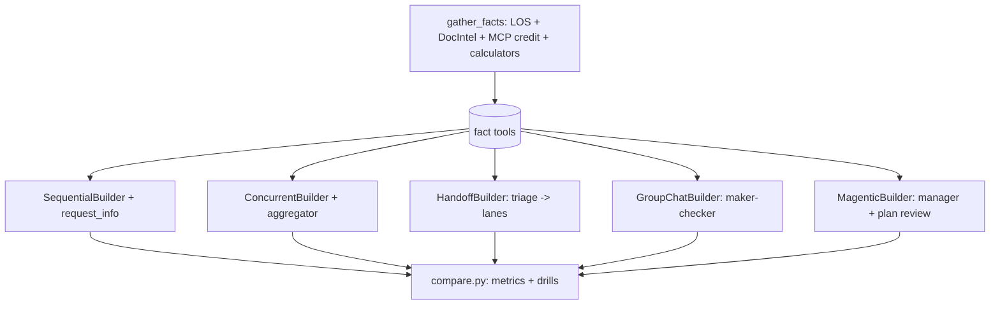

# Orchestration patterns (`src/agentplatform/orchestrations/`)

The same loan conditions review run through MAF's five prebuilt orchestrations, with a measured comparison and fault drills.

**Sections:** [1. Purpose](#1-purpose) · [2. Architecture](#2-architecture) · [3. How it works](#3-how-it-works) · [4. Key files](#4-key-files) · [5. Code excerpts](#5-code-excerpts) · [6. Configuration](#6-configuration) · [7. Commands](#7-commands) · [8. Real output](#8-real-output) · [9. Tests and eval gates](#9-tests-and-eval-gates) · [10. Guardrails](#10-guardrails) · [11. Security and governance](#11-security-and-governance) · [12. Observability](#12-observability) · [13. Failure modes](#13-failure-modes) · [14. Mapping to Azure services](#14-mapping-to-azure-services) · [15. Limitations](#15-limitations) · [16. Interview talking points](#16-interview-talking-points) · [17. Adopt this](#17-adopt-this)

## 1. Purpose

Choosing between sequential, concurrent, handoff, group chat and Magentic is a design decision with costs. This package runs one business task through all of them on the same facts so the trade-offs (LLM calls, turns, human pauses, behaviour under faults) are measured, not asserted.

## 2. Architecture



## 3. How it works

1. `gather_facts(loan_id)` builds a fact sheet from the same data plane as the flagship and computes per-lane flags; `expected_flags()` is the answer key.
2. `roles.py` defines triage, income, credit and assets analysts, the underwriter and the reviewer, with tools that read the facts.
3. Each pattern module builds its MAF workflow; offline every agent is a real MAF `Agent` on `MockChatClient` with a scripted reply.
4. `hitl.drive()` answers `request_info` events with a responder, bounded by a maximum number of pauses.
5. `compare.py` runs every pattern on three loans and on fault drills (analyst down, reviewer never approves, missing loan id, round cap, restart) and renders the table.

## 4. Key files

| File | What it holds |
|---|---|
| `src/agentplatform/orchestrations/facts.py` | fact sheet and answer key |
| `src/agentplatform/orchestrations/roles.py` | agents, tools and offline scripts |
| `src/agentplatform/orchestrations/sequential.py` … `magentic.py` | one builder per pattern |
| `src/agentplatform/orchestrations/hitl.py` | bounded human responder |
| `src/agentplatform/orchestrations/compare.py` | metrics and drills |
| `docs/orchestration-patterns.md` | the rendered comparison and trade-offs |

## 5. Code excerpts

Concurrent fan-in that refers when a lane is missing:

<!-- code: src/agentplatform/orchestrations/concurrent.py::aggregate -->
```python
def aggregate(results: list[AgentExecutorResponse]) -> dict:
    """Fan-in: a lane with no FLAGS line is a missing lane -> refer, never a silent approve."""
    turns, flags, missing = [], [], []
    for r in results:
        text = r.agent_response.text
        turns.append((r.executor_id, text))
        if "FLAGS:" not in text:
            missing.append(r.executor_id)
        flags += parse_list(FLAGS_RE, text)
    final = verdict(flags)
    if missing:
        final = final.rsplit("DECISION:", 1)[0] + f"DECISION: refer\nMISSING_LANES: {', '.join(missing)}"
    return {"final": final, "turns": turns, "missing": missing}
```
<!-- /code -->

Bounded human responder:

<!-- code: src/agentplatform/orchestrations/hitl.py::drive -->
```python
async def drive(
    first: Callable[[], Awaitable[WorkflowRunResult]],
    workflow: Workflow,
    respond: Responder,
    *,
    max_pauses: int = 5,
    seen: list[str] | None = None,
) -> tuple[WorkflowRunResult, list[WorkflowRunResult]]:
    """Run, then answer each pending request with `respond(request_data)` until idle (or max_pauses).

    Returns the last result and every intermediate one (outputs are spread across runs)."""
    seen = seen if seen is not None else []
    results = [await first()]
    while (pending := results[-1].get_request_info_events()) and len(seen) < max_pauses:
        answers = {}
        for ev in pending:
            seen.append(type(ev.data).__name__)
            with span("orchestration.hitl", request=type(ev.data).__name__):
                answers[ev.request_id] = respond(ev.data)
        results.append(await workflow.run(responses=answers))
    return results[-1], results
```
<!-- /code -->

## 6. Configuration

| Knob | Effect |
|---|---|
| `AAP_MODE=azure` | agents use Foundry through `get_chat_client()` |
| `max_rounds` (group chat) | cap before an unapproved stop |
| `max_round_count`, stall and reset limits (Magentic) | manager loop limits |
| pause limit in `hitl.drive` | maximum human interactions per run |

## 7. Commands

```bash
python scripts/orchestrations_demo.py            # transcripts
python scripts/orchestrations_demo.py --compare  # metrics table
pytest tests/test_orchestrations.py -q
```

## 8. Real output

<!-- output-md: python scripts/orchestrations_demo.py --compare -->
<!-- comparison:start -->
| Pattern | Exact conditions + decision (3 loans) | Flag recall | LLM calls / loan | Agent turns / loan | HITL pauses / loan | Decisions (L-1001, L-1002, L-1003) |
|---|---|---|---|---|---|---|
| sequential | 3/3 | 1.00 | 7.0 | 4.0 | 1.0 | approve_with_conditions, refer, refer |
| concurrent | 3/3 | 1.00 | 6.0 | 3.0 | 0.0 | approve_with_conditions, refer, refer |
| handoff | 3/3 | 1.00 | 6.3 | 3.7 | 0.0 | approve_with_conditions, refer, refer |
| group_chat (selection_func) | 3/3 | 1.00 | 9.0 | 5.0 | 0.0 | approve_with_conditions, refer, refer |
| group_chat (orchestrator_agent) | 3/3 | 1.00 | 14.0 | 5.0 | 0.0 | approve_with_conditions, refer, refer |
| magentic | 3/3 | 1.00 | 15.0 | 4.0 | 1.0 | approve_with_conditions, refer, refer |

| Pattern | Drill | Decision | Stop reason | LLM calls | HITL pauses |
|---|---|---|---|---|---|
| sequential | assets analyst down (L-1001) | refer | completed | 6 | 1 |
| concurrent | assets analyst down (L-1001) | refer | missing_lanes | 5 | 0 |
| handoff | assets analyst down (L-1001) | none | awaiting_user | 7 | 2 |
| group_chat (selection_func) | assets analyst down (L-1001) | refer | approved | 10 | 0 |
| magentic | assets analyst down (L-1001) | refer | completed | 23 | 2 |
| group_chat (selection_func) | reviewer never approves (L-1001) | refer | max_rounds_unapproved | 13 | 0 |
| handoff | request has no loan id (L-1002) | refer | completed | 8 | 1 |
| magentic | max_round_count=2 (L-1001) | refer | limit_reached | 8 | 1 |
| sequential | process restart while paused (L-1003) | refer | completed | 7 | 1 |
<!-- comparison:end -->
<!-- /output -->

## 9. Tests and eval gates

<!-- output: python -m pytest --co -q -p no:cacheprovider tests/test_orchestrations.py | grep '::' -->
```text
tests/test_orchestrations.py::test_facts_come_from_the_data_plane[L-1001]
tests/test_orchestrations.py::test_facts_come_from_the_data_plane[L-1002]
tests/test_orchestrations.py::test_facts_come_from_the_data_plane[L-1003]
tests/test_orchestrations.py::test_every_pattern_reaches_the_rule_answer[L-1001-concurrent]
tests/test_orchestrations.py::test_every_pattern_reaches_the_rule_answer[L-1001-group_chat (orchestrator_agent)]
tests/test_orchestrations.py::test_every_pattern_reaches_the_rule_answer[L-1001-group_chat (selection_func)]
tests/test_orchestrations.py::test_every_pattern_reaches_the_rule_answer[L-1001-handoff]
tests/test_orchestrations.py::test_every_pattern_reaches_the_rule_answer[L-1001-magentic]
tests/test_orchestrations.py::test_every_pattern_reaches_the_rule_answer[L-1001-sequential]
tests/test_orchestrations.py::test_every_pattern_reaches_the_rule_answer[L-1002-concurrent]
tests/test_orchestrations.py::test_every_pattern_reaches_the_rule_answer[L-1002-group_chat (orchestrator_agent)]
tests/test_orchestrations.py::test_every_pattern_reaches_the_rule_answer[L-1002-group_chat (selection_func)]
tests/test_orchestrations.py::test_every_pattern_reaches_the_rule_answer[L-1002-handoff]
tests/test_orchestrations.py::test_every_pattern_reaches_the_rule_answer[L-1002-magentic]
tests/test_orchestrations.py::test_every_pattern_reaches_the_rule_answer[L-1002-sequential]
tests/test_orchestrations.py::test_every_pattern_reaches_the_rule_answer[L-1003-concurrent]
tests/test_orchestrations.py::test_every_pattern_reaches_the_rule_answer[L-1003-group_chat (orchestrator_agent)]
tests/test_orchestrations.py::test_every_pattern_reaches_the_rule_answer[L-1003-group_chat (selection_func)]
tests/test_orchestrations.py::test_every_pattern_reaches_the_rule_answer[L-1003-handoff]
tests/test_orchestrations.py::test_every_pattern_reaches_the_rule_answer[L-1003-magentic]
tests/test_orchestrations.py::test_every_pattern_reaches_the_rule_answer[L-1003-sequential]
tests/test_orchestrations.py::test_sequential_pauses_after_underwriter_and_accepts_feedback
tests/test_orchestrations.py::test_sequential_resumes_from_checkpoint_in_a_fresh_graph
tests/test_orchestrations.py::test_concurrent_missing_lane_refers_instead_of_approving
tests/test_orchestrations.py::test_handoff_routes_only_to_lanes_with_findings
tests/test_orchestrations.py::test_handoff_asks_the_human_when_the_loan_id_is_missing
tests/test_orchestrations.py::test_handoff_dead_end_stays_with_the_human
tests/test_orchestrations.py::test_handoff_builder_requires_history_persistence_flag
tests/test_orchestrations.py::test_group_chat_round_cap_is_a_safe_stop
tests/test_orchestrations.py::test_group_chat_checker_catches_a_missing_lane
tests/test_orchestrations.py::test_group_chat_agent_orchestrator_costs_one_call_per_round
tests/test_orchestrations.py::test_magentic_plan_review_revise_then_approve
tests/test_orchestrations.py::test_magentic_stall_resets_replans_and_carries_the_failed_lane
tests/test_orchestrations.py::test_magentic_round_cap_terminates
tests/test_orchestrations.py::test_roster_numbers_only_come_from_tools
tests/test_orchestrations.py::test_comparison_doc_is_fresh
```
<!-- /output -->

The tests require 3/3 exact decisions and flag recall 1.00 for every pattern, and each drill to stop with the expected reason.

## 10. Guardrails

- Agents read numbers through tools and never compute them.
- Every pattern has a hard cap (rounds, pauses, stalls) and a named stop reason.
- A missing lane or an unapproved maker-checker loop refers, never approves.

## 11. Security and governance

- The same tool gateway and identity apply as in the flagship.
- Human approvals in sequential and Magentic are recorded in the run result.

## 12. Observability

Each human interaction is an `orchestration.hitl` span; agent turns and LLM calls are counted per run and appear in the comparison table.

## 13. Failure modes

The drill rows in the real output are the failure modes: a down analyst, a reviewer that never approves, a request without a loan id, a round cap and a restart while paused, each with its stop reason.

## 14. Mapping to Azure services

| Piece | Azure service |
|---|---|
| agents | Microsoft Foundry deployments via MAF |
| checkpoints | Cosmos DB (same storage as the flagship) |
| traces | Application Insights |

## 15. Limitations

- Offline scripts make the comparison deterministic; real model behaviour would vary run to run.
- LLM call counts are from the mock scripts, so they show relative cost, not real token spend.

## 16. Interview talking points

- Start with the simplest pattern that meets the need; the table shows Magentic costs about twice the calls of sequential for the same answer.
- Fault drills reveal more than the happy path: handoff stalls waiting for a user when an analyst is down.

## 17. Adopt this

1. Replace `facts.py` with your fact gathering and `expected_flags` with your answer key.
2. Rewrite the roles' instructions; keep tools as the only source of numbers.
3. Run `--compare` and pick the cheapest pattern that passes your drills.
