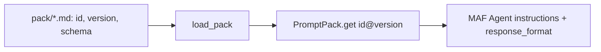

# Prompt pack (`src/agentplatform/prompts/`)

Versioned prompts stored as Markdown with front matter and bound to Pydantic output schemas.

**Sections:** [1. Purpose](#1-purpose) · [2. Architecture](#2-architecture) · [3. How it works](#3-how-it-works) · [4. Key files](#4-key-files) · [5. Code excerpts](#5-code-excerpts) · [6. Configuration](#6-configuration) · [7. Commands](#7-commands) · [8. Real output](#8-real-output) · [9. Tests and eval gates](#9-tests-and-eval-gates) · [10. Guardrails](#10-guardrails) · [11. Security and governance](#11-security-and-governance) · [12. Observability](#12-observability) · [13. Failure modes](#13-failure-modes) · [14. Mapping to Azure services](#14-mapping-to-azure-services) · [15. Limitations](#15-limitations) · [16. Interview talking points](#16-interview-talking-points) · [17. Adopt this](#17-adopt-this)

## 1. Purpose

Prompts are code: versioned, reviewed and tied to the schema the agent must return.

## 2. Architecture



## 3. How it works

1. Each file in `pack/` has front matter (id, version, schema name) and the instruction text.
2. `load_pack()` parses every file; `get(id, version)` returns a `PromptSpec`.
3. Agents are built with the spec's instructions and its schema as structured output.

## 4. Key files

| File | What it holds |
|---|---|
| `src/agentplatform/prompts/registry.py` | `PromptSpec`, `PromptPack`, `load_pack` |
| `src/agentplatform/prompts/schemas.py` | output schemas |
| `src/agentplatform/prompts/pack/` | the prompts (no README here: every `.md` is parsed as a prompt) |

## 5. Code excerpts

<!-- code: src/agentplatform/prompts/registry.py::PromptPack.get -->
```python
def get(self, prompt_id: str, version: str | None = None) -> PromptSpec:
    if version:
        return self._by_ref[f"{prompt_id}@{version}"]
    candidates = [s for s in self._by_ref.values() if s.id == prompt_id]
    if not candidates:
        raise KeyError(prompt_id)
    return max(candidates, key=lambda s: tuple(int(x) for x in s.version.split(".")))
```
<!-- /code -->

## 6. Configuration

Pin a version with `get(prompt_id, version)`; the latest is used otherwise.

## 7. Commands

```bash
python scripts/component_demos.py prompts
python scripts/foundry_register.py --dry-run   # prompts become Foundry agent definitions
```

## 8. Real output

<!-- output: python scripts/component_demos.py prompts -->
```text
hr.policy@1.0.0
it.servicedesk@1.0.0
mortgage.assets@1.0.0
mortgage.conditions@1.0.0
mortgage.credit@1.0.0
mortgage.critic@1.0.0
mortgage.decision_letter@1.0.0
mortgage.income@1.0.0
mortgage.intake@1.0.0
```
<!-- /output -->

## 9. Tests and eval gates

`tests/test_harness.py` loads the pack and checks schema binding; every eval run exercises the pinned prompts.

## 10. Guardrails

- Structured output: a reply that does not fit the schema is rejected.

## 11. Security and governance

- Prompt changes are reviewed like code and bump the version.

## 12. Observability

The prompt reference (`id@version`) is recorded on the node span.

## 13. Failure modes

| Failure | What happens |
|---|---|
| unknown prompt id | `KeyError` at start-up |
| schema mismatch | fallback draft |

## 14. Mapping to Azure services

| Piece | Azure service |
|---|---|
| agent definitions | Foundry Agent Service (via `foundry_register.py`) |

## 15. Limitations

- No A/B testing of prompt versions.

## 16. Interview talking points

- Binding prompt to schema makes prompt changes testable.

## 17. Adopt this

1. Add `pack/<id>.md` with front matter.
2. Add its schema to `schemas.py`.
3. Bump the version on every change.
