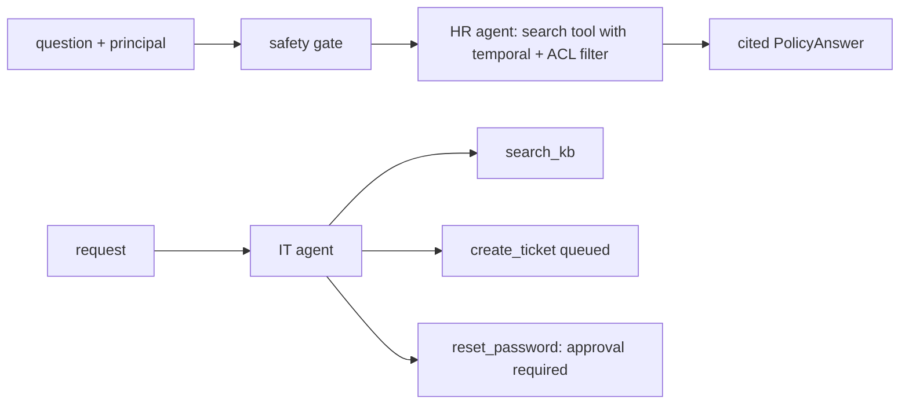

# Single agents: HR policy and IT service desk (`src/agentplatform/single/`)

Two deliberately small agents: one prompt, a few tools, no graph.

**Sections:** [1. Purpose](#1-purpose) · [2. Architecture](#2-architecture) · [3. How it works](#3-how-it-works) · [4. Key files](#4-key-files) · [5. Code excerpts](#5-code-excerpts) · [6. Configuration](#6-configuration) · [7. Commands](#7-commands) · [8. Real output](#8-real-output) · [9. Tests and eval gates](#9-tests-and-eval-gates) · [10. Guardrails](#10-guardrails) · [11. Security and governance](#11-security-and-governance) · [12. Observability](#12-observability) · [13. Failure modes](#13-failure-modes) · [14. Mapping to Azure services](#14-mapping-to-azure-services) · [15. Limitations](#15-limitations) · [16. Interview talking points](#16-interview-talking-points) · [17. Adopt this](#17-adopt-this)

## 1. Purpose

Show when a single agent is the right shape: bounded Q&A and triage, with at most one human-approved write.

## 2. Architecture



## 3. How it works

1. `ask_hr` screens the question, then the agent calls a search tool whose filter applies as-of and group trimming.
2. The answer cites the policy id in force (12 weeks before, 16 weeks after the policy change).
3. `run_it` runs the IT agent; `reset_password` has `approval_mode="always_require"`, so it only runs with a named approver.

## 4. Key files

| File | What it holds |
|---|---|
| `src/agentplatform/single/hr_agent.py` | HR agent |
| `src/agentplatform/single/it_agent.py` | IT agent, `ITDesk` |
| `scripts/foundry_register.py` | Foundry Agent Service definitions (dry-run) |

## 5. Code excerpts

<!-- code: src/agentplatform/single/hr_agent.py::make_search_tool -->
```python
def make_search_tool(backend: SearchBackend, principal: Principal, as_of: date):
    @tool(name="search_hr_policy", description="Search HR policy passages in force for the caller.")
    def search_hr_policy(query: str) -> str:
        hits = backend.search(SearchQuery(query, as_of, principal.groups, top=3))
        docs = [
            {"id": h.chunk.id, "title": h.chunk.title, "content": h.chunk.content, "score": round(h.score, 4)}
            for h in hits
            if h.score >= MIN_SCORE
        ]
        gate = get_safety_gate()
        docs = [
            d
            for d, v in zip(docs, gate.check_documents([d["content"] for d in docs]), strict=True)
            if v.allowed
        ]
        return json.dumps(docs)

    return search_hr_policy
```
<!-- /code -->

<!-- code: src/agentplatform/single/it_agent.py::build_it_agent -->
```python
def build_it_agent(principal: Principal, desk: ITDesk) -> Agent:
    client = get_chat_client()
    if isinstance(client, MockChatClient):
        client.script = _offline_policy
    return Agent(
        client=client, name="it-servicedesk-agent", instructions=PROMPT.body, tools=desk.tools(principal)
    )
```
<!-- /code -->

## 6. Configuration

| Variable | Effect |
|---|---|
| `AZURE_SEARCH_HR_INDEX` | HR policy index |
| `AAP_MODE` | offline or Foundry |

## 7. Commands

```bash
python scripts/component_demos.py single
python scripts/foundry_register.py --dry-run
pytest tests/test_single_agents.py -q
```

## 8. Real output

<!-- output: python scripts/component_demos.py single -->
```text
hr as_of=2024-03-01: citations=['HR-PAR-01'] limited=False
hr as_of=2026-03-01: citations=['HR-PAR-02'] limited=False
hr salary bands as employee: citations=[] limited=True
it reset without approver: [{'tool': 'reset_password', 'approved': False, 'approver': None}] resets: []
it reset with approver: [{'tool': 'reset_password', 'approved': True, 'approver': 'sd-lead'}] resets: ['jdoe']
```
<!-- /output -->

## 9. Tests and eval gates

<!-- output: python -m pytest --co -q -p no:cacheprovider tests/test_single_agents.py | grep '::' -->
```text
tests/test_single_agents.py::test_hr_answer_is_cited_and_as_of_aware
tests/test_single_agents.py::test_hr_security_trimming
tests/test_single_agents.py::test_hr_inbound_injection_blocked
tests/test_single_agents.py::test_it_ticket_path_no_approval
tests/test_single_agents.py::test_it_password_reset_requires_human_approval
tests/test_single_agents.py::test_foundry_definitions_dry_run
```
<!-- /output -->

The HR golden set is part of the release gate (`answer_contains`, `citation_exact`).

## 10. Guardrails

- Filtering is in the tool, not the prompt.
- The only write with real impact requires a human approver.

## 11. Security and governance

- Employees cannot see manager-only content (salary bands).

## 12. Observability

Tool calls and approvals are traced and returned in the result.

## 13. Failure modes

| Failure | What happens |
|---|---|
| blocked input | limited answer |
| no approver | reset declined, ticket suggested |

## 14. Mapping to Azure services

| Piece | Azure service |
|---|---|
| agents | Foundry Agent Service |
| search | Azure AI Search tool |

## 15. Limitations

- Tiny synthetic corpora.

## 16. Interview talking points

- Not everything needs a graph; pick the smallest shape that is safe.

## 17. Adopt this

1. Copy `hr_agent.py` for a policy Q&A agent; point the tool at your index.
2. Mark any impactful tool `always_require`.
